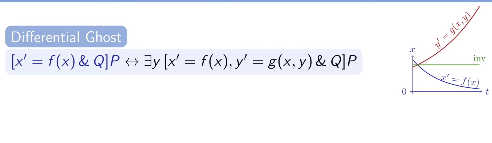

# README

- [README](#readme)
  - [Using dL in PVS](#using-dl-in-pvs)
    - [First do this](#first-do-this)
    - [Intro to PVS](#intro-to-pvs)
      - [Variables and Constants](#variables-and-constants)
    - [Writing things in PVS and dL](#writing-things-in-pvs-and-dl)
    - [Proving things in PVS and dL](#proving-things-in-pvs-and-dl)
      - [Miscellaneous](#miscellaneous)
      - [Simplification](#simplification)
      - [Utilities](#utilities)
      - [dL Commands](#dl-commands)
    - [Differential Ghosts and Invariants](#differential-ghosts-and-invariants)
    - [Off-Topic Math](#off-topic-math)
  - [KeYmaera](#keymaera)

> This README is an overview of all the pages in this repo, which summarize my
> internship with the Formal Methods team at NASA from June 2023 - present. Notes
> have been taken that include my learning process for using PVS, using the
> Virtual Machine (I had to use an Amazon Linux image because of M2 chip
> incompatibility), and creating things and proving them with dL. Furthermore,
> these notes were transferred from Logseq --> pure Markdown (manually), so there
> may be some formatting errors. The end goal of these notes is to document my
> research and allow a future intern/user of dL PVS to get acquainted with the
> technology easier.

## Using dL in PVS

### First do this

- go through the useful resources page
- watch the intro video
- read some documentation and papers about PVS and dL
  - See [Embedding Differential Logic in PVS](assets/LSFA_23_submit.pdf)
- ask Tanner for his paper about dL, its super useful
- either buy a mac or Linux machine or see [How to use PVS on Windows](pages/pvs-on-windows.md)

### Intro to PVS

- turnstile: `|---------------------`
- Propositional Logic: if, and, or, etc
- LEMMA: thing you need to prove
- above the turnstile : ALL IS TRUE (AND) (antecedent)
- below the turnstile : one is true ALWAYS (OR) (consequent)

### Variables and Constants

- Constants can be defined as PVS variables like so, and must be referenced with
  a `cnst( )` around them

  `x: VAR real`

- Variables are defined as natural numbers with UNIQUE arbitrary values that
  correspond to their index, and must be referenced with a `val( )` around them

  `x: nat = 0`

  <!--TODO: Update new dL variables syntax-->

  > [!NOTE]
  > As of the new PVS version 8, variables are defined differently.

### Writing things in PVS and dL

- [`IMPORTING dL@top`](pages/IMPORTING.md)
- [`DIFF()`](pages/DIFF.md)
- [`LEMMA`](pages/lemma.md)
- [`UNION()`](pages/UNION.md)
- [`IFTE()`](pages/IFTE.md)
- [`(BETA)`](pages/beta.md)
- [`TEST()`](pages/test.md)
- [`div_safe_re()`](pages/div_safe_re.md)
- [`SEQ()`](pages/SEQ.md)
- [`STAR(ag)`](pages/star.md)
- [`^^`](pages/exponentiation.md)
- [`ALLRUNS(DIFF())`](pages/ALLRUNS.md)
- [`SOMERUNS(DIFF())`](pages/SOMERUNS.md)

### Proving things in PVS and dL

- see [this cheat sheet](assets/plaidypvs_cheatsheet.png)

#### Miscellaneous

- [`(inst)`](pages/inst.md)
- [`(skolem)`](pages/skolem.md)
- [`(skeep)`](pages/skeep.md)
- [`(flatten)`](pages/flatten.md)
- [`(split)`](pages/)
- [`(expand)`](pages/expand.md)
- [`(iff)`](pages/IFF.md)
- [`(replaces)`](pages/replaces.md)
- [`(skoletin)`](pages/skoletin.md)

#### Simplification

- [`(prop)`](pages/prop.md)
- [`(bddsimp)`](pages/bddsimp.md)
- [`(assert)`](pages/assert.md)
- [`(ground)`](pages/ground.md)
- [`(smash)`](pages/smash.md)
- [`(grind)`](pages/grind.md)
- [`(metit)`](metit.md)

#### Utilities

- [`(help)`](pages/help.md)
- [`(lemma)`](pages/lemma.md)
- [`(quit)`](pages/quit.md)
- [`(undo)`](pages/undo.md)
- [`(hide)`](pages/hide.md)
- [`(postpone)`](postpone.md)

#### dL Commands

- See `dynamic_logic.pvs` in nasalib for definitions and [Glossary Plaidypvs](./assets/Glossary_Plaidypvs.pvs) for examples
- [`(<command>b)`](pages/box.md)
- [`(<command>d)`](pages/diamond.md)
- [`(dl-loop)`](pages/loop.md)
- [`(dl-solve)`](pages/solve.md)
- [`(dl-subs)`](pages/sub.md)
- [`(dl-composeb)`](pages/compose.md)
- [`(dl-flatten)`](pages/flatten.md)
- [`(dl-ghost)`](pages/ghosts.md)
- [`(dl-diffghost)`](pages/diffghost.md)
- [`(dl-diffinv)`](pages/diffinv.md)
- [`(dl-inst)`](pages/inst.md)
- [`(dl-grind)`](pages/dl-grind.md)
- [`(dl-diffcase)`](pages/diffcase.md)
- [`DLEXISTSRf`](pages/DLEXISTSRf.md)

### Differential Ghosts and Invariants

- most differential equations are impossible to solve
- solving ODE's will often make them more complicated then necessary
  - discrete ghost `(dl-ghost)`
    - extra variable introduced to a proof to analyze the model
    - remember the value of a new variable in an old state for analyzing the
      change of an expression
    - discrete variable y which remembers the value of e (fresh)
    - Fresh Variables = new variable that doesn't affect main function
- differential ghosts:
  - evolve over time
  - extra variable added with a made up differential equation to analyze the
    system
  - increase complexity of the system
  - change the differential equation itself
  - (auxiliary variables) added to make the proof more conclusive, don't really
    exist
- `diff-ghost`:

  - you are trying to prove x is always positive (it approaches 0 as it reaches
    infinity)
  - you introduce a new equation: $y' = y/2$
  - then you can say that `x-y^2=1`
  - why? Because $y^2$ is always positive, so anything that $x$ is must also be
    positive
  - $y$ acts as a counterweight, always lifting x just enough to remain positive
  - my questions:
    - how do you figure out what y should equal?
      - GO BACKWARDS
      - we know that you have to use `diffinv` right after you introduce the
        ghost, so do that and have an unknown $j(x)$ as the ghost
      - you should end up with an equation that = 0, so find the ghost
        expression that can satisfy it
    - how can you know for sure that `xy^2=1`?
      - that is just a property of any positive number $(x)$, use some reasoning
        to find small expressions like that that work for all numbers so you can
        build ghost variables around them
    - the new function must exist for as long as or longer than the original
      function that you are reasoning about

- `(dl-diffinv)`
  - use this after `diffghost`
  - when you have a Hybrid Program and something you want to prove is true (the
    HP would define the movement of the variable in the equation), differentiate
    the equation (and make sure to use values like x', y', etc) and plug in the
    values that you know those primes are equal to (from the HP definition)
  - you should get stuff that cancels out !!
  - (or rather an equation that equals 0)
- useful graphic:

  - Below: the differential ghost equation acts as a counterweight to f(x),
    ensuring that $xy^2 = 1$ will always be true, proving that x must always be
    positive

    

## KeYmaera

- see [KeYmaera](pages/keymaera.md)
