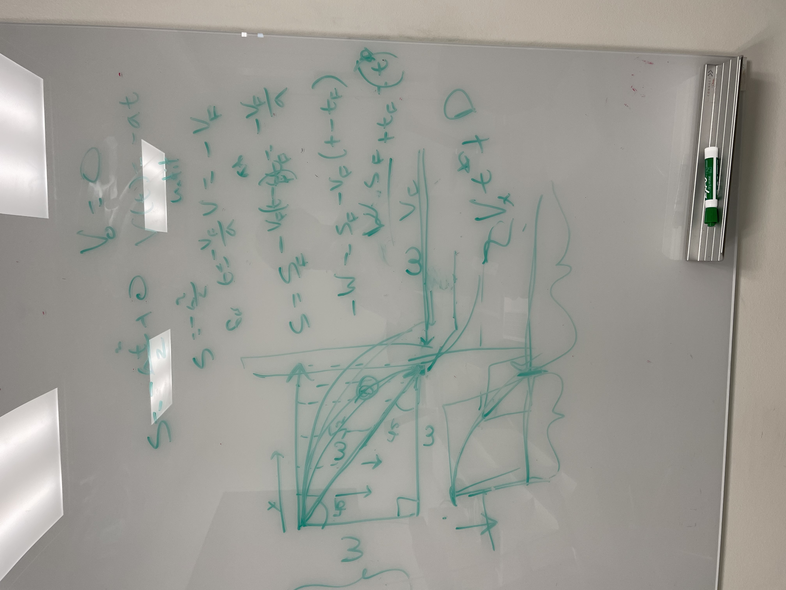
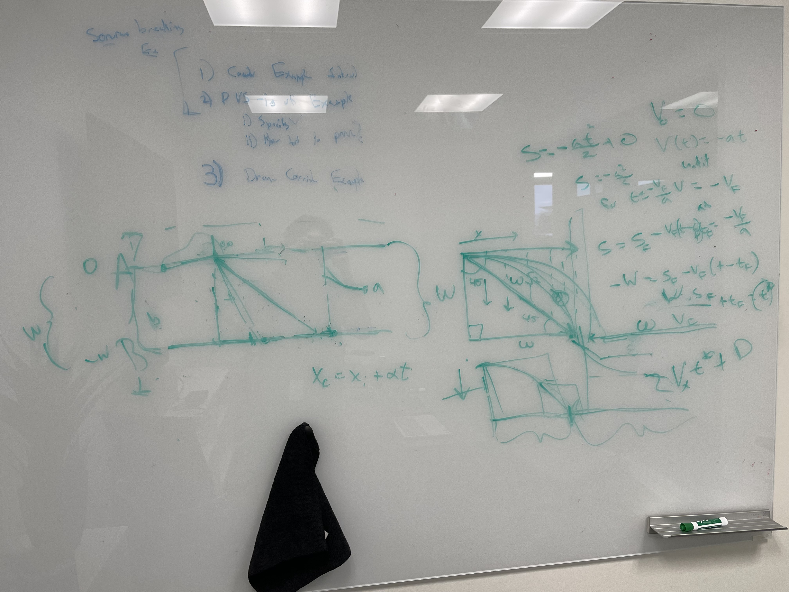

2023-10-18
==========

Today I did three things.

## Thing 1
First I wrote out some instructions for Tanner to run PVS in Windows with WSL,
like I was able to with my personal laptop. PVS, by nature, only runs on UNIX
based operating systems, meaning only Linux and MacOS. Windows, however, can run
subsystem for Linux (WSL), and if Vscode is running WITHIN WSL, pvs will work.
However, Microsoft has dedicated features where developers can access WSL files
from a Vscode that is a Windows process, and wants people to use that rather
than running Vscode in WSL. Unfortunately, doing this does not get PVS to work,
since PVS still thinks you're in Windows. (see [here](../pages/pvs-on-windows.md))

## Thing 2
Next I rebuilt the Example 1e proof in KeYmaera. I reached the same point I did
last time but I need Wolfram Alpha to be connected to the internet to use it, so
I will have to finish that proof at home. (see [here](../pages/Example1e.md))

## Thing 3
Lastly, Tanner and I talked about the Example 2, which is called the Drone
Corridor. In this scenario, a drone we control is approaching a drone we do not
control in a corridor with width W. Both drones have the same maximum
velocities. The goal is for our drone (a) to switch its `y` velocity to exit the
corridor and evade the drone `b`, which we cannot control. The top of the corridor
is point A, and the bottom is point B, which are W apart. Furthermore, there are
two lines, or borders, that are near the center of the corridor, which dictate
how far apart a must be from b so that a can start diverting its path and NOT
hit b. Our goal is to describe where these two bordering lines should be so that
the system is always safe.

First, we consider the worst possibility. In this case, both a and b start on
the border lines, giving drone `a` no time to react. Furthermore, drone `a` will
start at point A, and drone `b` at point B. Drone `a` must immediately switch on its
maximum y velocity, and in doing so starts a diagonal trajectory towards B. On
the other side, the worst case scenario is drone `b` is approaching drone `a`'s
future position on point B at its maximum velocity. Drone a's path becomes a
45/45/90 triangle with the border of width W and the edge of the corridor.
Although drone a's velocity, (maximum x and y velocity) is greater than drone b
(maximum x velocity, 0 y), since the diagonal path of drone a is larger, they
will both reach a center point between the two borders at the EXACT same time.
Therefore, the way to make the borders safe is to make sure they are $2*W + D$
apart, where D is some distance. If the width is only $2w$, the two drones will
get arbitrary close together. 

Next, we consider a slightly more realistic variation where the controller for
drone a controls the acceleration, not the velocity. In this case, the drone
cannot switch to its maximum y velocity like we would have liked. Drone a's path
now looks more like a parabola, and reaches line B at a point farther than it
did in the last variation. In this case we can assume the following:

$$ s = \frac {at^2}2 + 0 $$
$$ V_{y0} = 0, V(t) = -at $$ 

However, the y acceleration above only continues until the max y velocity is
reached, which we can calculate:

$$ t= \frac{-V_f}{a}V = -V_f $$ 

At this time, the drone is at position: 

$$ s = s_f-V_f(t-t_f) = -\frac {V_f} a $$
$$ -W = s_f-V_f(t-t_f) $$

$$ \frac {Ws_f}{V_f} + t_f = (t*) $$

 Therefore, the borders must be this far apart: 

$$ 2V_x(t*) + D $$

See the images below.

<!--  TODO: upload pictures here from whiteboard -->

