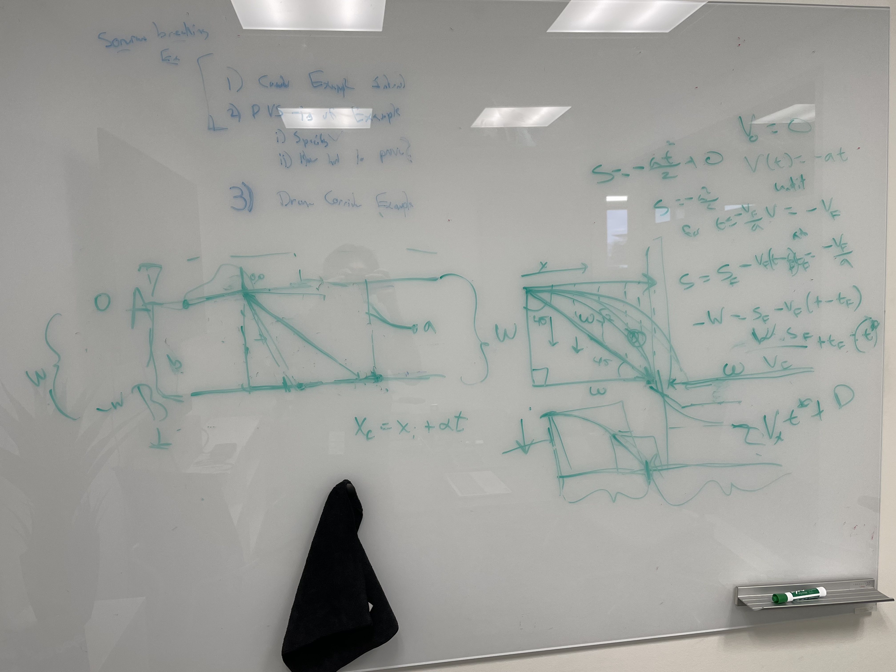

# Translating to PVS and Proving

The first thing I'm planning to work on is beginning the PVS proof for Example
1e. Then I will try to specify Example 2 as well.

I learned that i can use the `(dl-iterated)` command to split up the loop in
Example 1e to the first and second run. This will the first step in the
proof.

I also talked to Tanner about the RTA framework, which he wants me to build a
switch-back system for. In RTA, which has been somewhat proven with dL, there
are two systems, A and B. A is the uncontrolled system, or the pilot/human. Then
there is a monitor, M, and safe condition, S, that switches from the free system
to the revisionary system, B, whenever the safe condition is false. Tanner wants
me to implement a system that has a similar monitor, M_b, that, once another
condition, S_b, is met, switches BACK from the revisionary system to the
uncontrolled system. This basically means that once things are safe, we no
longer need to control the vehicle, the pilot can go back to doing whatever he
wants. The entirety of this system also implies (-->) P, a safety property. P is
what we want to prove.

I also learned about the `(replace -1)`, `(name "A" "{expression}")`, and
`(replace -1 1 rl)`, which can be used to make a proof look a lot cleaned,
especially when particular runs are being extracted from a loop, like I am doing
in Example 1e.

Example:

```pvs
(name "A" "UNION(DIFF((: (x, val(v)), (v, val(a)) :), val(x) <=
cnst(bf)), SEQ(SEQ(TEST(val(x) = cnst(bf)), ASSIGN((: (vi, val(v)) :))), DIFF((:
(x, val(v)), (v, div_safe_re ((cnst(-1) * LAMBDA (s: Environment): val(vi)(s) ^
cnst(2)(s)), (cnst(2) * (cnst(E) - cnst(bf))))) :), val(x) >= cnst(bf))))")
```

Then, to move the name from the antecedent to the bottom of the turnstile, ,

```pvs
(replace -1)
```

Then, to put the long expression back,

```pvs
(replace -1 1 rl)
```

My proof attempt is below:

```pvs
(dl-flatten)(name "A" "UNION(DIFF((: (x, val(v)), (v, val(a)) :), val(x) <=
cnst(bf)), SEQ(SEQ(TEST(val(x) = cnst(bf)), ASSIGN((: (vi, val(v)) :))), DIFF((:
(x, val(v)), (v, div_safe_re ((cnst(-1) * LAMBDA (s: Environment): val(vi)(s) ^
cnst(2)(s)), (cnst(2) * (cnst(E) - cnst(bf))))) :), val(x) >=
cnst(bf))))")(replace -1)(dl-iterated)(replace -1 1 rl)(replace -1)
```
Example 2 Drawing: 
 

