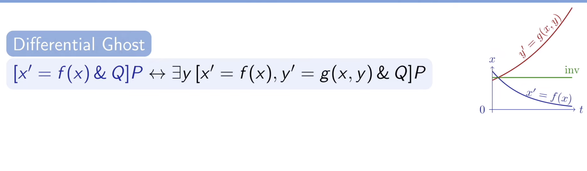
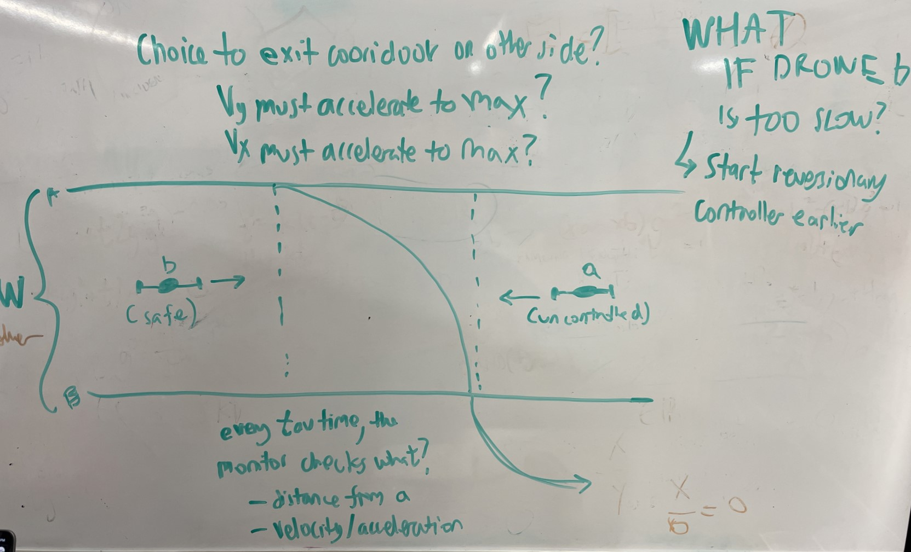

# What is this?

This markdown file is all of my journals in one file. Each entry starts with a
heading containing the date it was written.

# 2023-06-08

- Learned foundational commands in PVS
- will install pvs
- will start PVS course
- PVS Commands.
  - first lesson
    - above the turnstile : ALL IS TRUE (AND) (antecedent)
    - below the turnstile : one is true ALWAYS (OR) (consequent)
    - `split`: split
      - splits stuff into 2 branches, visible with branch button (proof tree)
    - `flatten`: flatten
    - `help (command)`: help
      - will give more information about command
    - `prop`: prop
      - ez works every time command (not rly) (FOR Propositional Logic)(meaning
      true and false)
    - `iff (something)`: IFF
      - converts to propositional reasoning (a = b -> a IFF b)

# 2023-06-12

- continuing PVS
- Instantiation: choose arbitrary value for any variable
  - `(inst -1 "1 * 10^12432565")`
- `skeep`
  - uses arbitrary value for variable
  - use this or inst, not both (I think)
- [x] completed all exercises
  - having trouble with quant_2
  - finished quant 2, had to use some obscure command
- EXPAND to prove factorials/recursion] stuff, it defines stuff in terms of the
real declaration of the thing itself, kinda confusing but works
- finished reading KeYMaera tutorial (very little tbf), now trying to write some
of the proofs with PVS using DL NASALib
- quite difficult...

# 2023-06-13

- went through a *bunch* of documentation for PVS and NASA Lib dL
- theres a lot less for DL than plain PVS
- Trying to learn more about [DIFF](../pages/DIFF.md), HP (Hybrid Programs)
- Diff only takes first order Differential equations, maybe potential for improvement?
- hard to think about translating higher order to first order
- what is a lemma...
- NEED TO LEARN ABOUT UNION and other similar functions defined in datatype, but
not very well documented
- going through DL Examples (exp growth first, trying to understand how to use
the DL@TOP library)

# 2023-06-14

- back to looking through nasalib/dL files and documentation
- will update with any progress or good information
- made good Toronto progress
  - recreating KeYmaera Differential Equation with `IFTE()` inside DLPVS
- Ended up using `IFTE`, not `UNION`
- need to learn how to assign stuff and do basic functions in dL (not the same
as KeYmaera tutorial)

# 2023-06-15

- watched Tanner's lecture about PVS, RTA and Plaidypvs which integrates
Differential Dynamic Logic into PVS, now recreating differential equations from
textbook using Plaidypvs (hopefully)
- Learned more about Hybrid Programs with Andre's book (CMU prof, super cool
textbook, began watching his lectures about his textbook because it is not
available for free)
- [playlist](https://www.youtube.com/playlist?list=PLnQeVMgmt_JdGIqhUDNoKQsPPWRjZzIo_)
- turns out HP is a pretty well documented field (mostly that one dude),
Plaidypvs is just one way to prove/reason about similar HP's (Andre uses
KeYmaera, not the same as DL/Plaidypvs in PVS)
- attended talk about Modeling stuff with some program and safety assurance or something
- MODELED a Bernoulli's differential equation, (kinda copied some
documentation), but was unable to manually prove the solution to be correct
- finding model-able equations inside of this list:
  - [list of named differential equations]( https://www.wikiwand.com/en/List_of_named_differential_equations )
- hard to fully understand most...

# 2023-06-16

- good toronto progress
- for ~~monday~~ tuesday:
  - !! ASK HIM to send you the paper (done)
  - dyn()
  - functions use when where etc?

# 2023-06-20

- tanner sending me thing to read
- reading and taking notes, have lots of questions for him
- waiting to ask questions

## ask tanner to model a diff eq for you to see how it is

- reading paper about DL embedding Differential Dynamic Logic
- ask questions tomorrow, listed in notebook
- show question 5 (type theory and famous dudes)

# 2023-06-21

- have lots of questions
- waiting for tanner to become available

# 2023-06-22

- modeled Newton's law of cooling in dL
- typechecking takes so long bruh
- trying to prove it is proving to be difficult

# 2023-06-23

- not sure how to use dl-diffghost
  - terms seem arbitrary and not connected to actual proof (simple proof really,
  saying that x'=x, when x >0, x' > 0)
  - seems simple but this command puts in some seemingly unrelated expression
- Logical Foundations of Cyber-Physical Systems resources
  - Overview
    - most differential equations are impossible to solve
    - solving ODE's will often make them more complicated then necessary
    - discrete systems: induction
      - generically analyze one step of the loop body
      - do the same for differential equation without solving (?)
  - Ghost Variables
    - discrete ghost
      - extra variable introduced to a proof to analyze the model
    - differential ghost
      - extra variable added with a made up differential equation to analyze the
      system
      - increase complexity of the system
      - change the differential equation itself
      - (auxiliary variables) added to make the proof more conclusive, don't
      really exist
      - discrete ghost: remember the value of a new variable in an old state for
      analyzing the change of an expression
        - discrete variable y which remembers the value of e (fresh)
          - fresh = new variable
        - bouncing ball example, create example folder
      - differential ghosts evolve over time

# 2023-06-26

- LEARNED how diff-ghost works
- see: 
- IMPORTANT: use `dl-flatten` when.... `DLIMPLIES`
- IMPORTANT: use expand to get function definitions
- IMPORTANT: `skeep` when `FORALL`
- `diff-ghost`:
  - you are trying to prove x is always positive (it approaches 0 as it reaches infinity)
  - you introduce a new equation: `y' = y/2`
  - then you can say that `x*y^2=1`
  - why? because y^2 is always positive, so anything that x is must also be positive
  - y acts as a counterweight, always lifting x just enough to remain positive
  - questions:
  - how do you figure out what y should equal?
    - GO BACKWARDS
    - we know that you have to use [diffinv](../pages/diffinv.md) right after
    you introduce the ghost, so do that and have an unkown j(x) as the ghost
    - you should end up with an equation that = 0, so find the ghost
    expression that can satisfy it
    - THATS IT
    - how can you know for sure that $xy^2=1$?
      - that is just a property of any positive number (x), use some reasoning
      to find small expressions like that that work for all numbers so you can
      build ghost variables around them - the new function must exist for as
      long as or longer than the original function that you are reasoning about

- `diffinv`:
  - use it after `diffghost`
  - when you have a HP and something you want to prove is true (the HP would
  define the movement of the variable in the equation), differentiate the
  equation (and make sure to use values like x', y', etc) and plug in
  the values that you know those primes are equal to (from the HP definition)
  - you should get stuff that cancels out !!
  - (or rather an equation that equals 0)

# 2023-06-27

- LEARNED NEW command
  - `div_safe_re`
    - division + safe + real expression
    - takes 2 things, numerator and denominator
    - USE THIS when you're not sure if the denominator isn't 0. (its safe)
    - generally used in tandem with dl-instt (which instantiates a new equation)
  - `lemma sqrt_hathat`
    - recognizes when an real exponentiation (^^) is 1/2 and converts that to sqrt()
  - `^^`: exponentiation to a real number
  - `^` only accepts nat numbers because their easy to work with, much simpler definition

# 2023-06-28

- finally proving the dl_cooling property
  - tanner helped me fix this one tiny error
  - used `val` instead of `cnst`
  - we'll see how this goes
- going to watch Tanner's talk about RTA and Plaidypvs
- began using emacs
- uh oh
- stuff not working
- (like pvs commands)
- tanner leaving tomorrow...

# 2023-06-29

- anything learned today?
- accidentally messed with vim, still trying to get emcas to work
- hello is this working
- test test test
- testing github updating/sync
- who knows if its going to keep syncing
  <<<<<<< HEAD
- i wonder how i wonder why
  - emacs FINALLY WORKS
- and GITHUB SYNC finally works
  - massive W
- it is indeed...
- got emacs to work, finally, and got the themes to be normal again

# 2023-06-30

- waiting for cesar to come so I can fix the diffghost and the ghosts example
- I wonder why there are no Hybrid Programs in my notes
- today I learned:
  - KeYmaera can run in the image, not locally
    - run command `java -jar keymaerax.jar`
    - open keymaera with this: <http://127.0.0.1:8090/>

# 2023-07-03

- finally back from NC
- can I get the image back up and running?
- who knows

## FOR TOMORROW

- Continue reading KeYmaera Chapter 12 (ghost explanation)
- Prove a basic example using KeYmaera
- Text Tanner about the type + Toronto

## FOR THE FUTURE

- Follow up on ghost proof and show Cesar the error message
- Bang Bang controller + Tanner's schedule

# 2023-07-05

- back to work

## today I am going to

- DONE understand the KeYmaera tutorial example
  - DONE learn why the instantiation happened
  - DONE text tanner about Toronto
  - DONE use KeYmaera to solve MY Proof and the example ghost proof (exp. decay)
- I found an important bug in the dl_cooling proof:
  - the first $k/2$ term has to have a cnst around ALL OF IT

# 2023-07-06

- Today I'm going to:
  - use KeYmaera to solve MY Proof and the example ghost proof (exp. decay)
  - write dl_cooling with KeYmaera
- ask Cesar about the `grind "^^"` dilemma (1 != 0)

# 2023-07-07

- [x] finish the bang bang controller
- very useful: 

# 2023-07-10

- im back to work, doing the bangbang controller
- good day
- working with emacs
- doing things
- yes
- following car
- bang bang is becoming hard to prove, tomorrow add preconditions to lemma and
try to prove again

# 2023-07-11

- DONE finish modeling following cars
- DONE prove a property of the following cars

# 2023-07-12

- REMINDER:
  - `<command>b` , the "b" stands for "box"
  - `<command>d`, the "d" stands for "diamond
- `composeb`
  - research

# 2023-07-13

- `diff-inv`
  - does not work in PVS 8 (emacs on my local machine)
  - however, it works in the image

# 2023-07-17

- now writing loop proof in PVS to see if annotation like features can work in PVS
- see [Annotations](../pages/Annotations.md)

# 2023-07-19

- learn how to use `dl-monod`, may be similar to [existsRmon](../pages/existsRmon.md)
- may need it to prove [dl_cooling]
- get to work

# 2023-07-20

- going to model bang bang variations (starting with velocity)

# 2023-07-24

- working on FINISHING cooling proof, then following proof, THEN consider
outlying controller cases and prove them

# 2023-07-25

- show tanner the lambda thingy you were getting after instantiating (in cooling)
- try to finish the cooling proof IN PVS
- dude its been so long
- working on FINISHING cooling proof, then following proof, THEN consider
outlying controller cases and prove them

## I despise the image

## Why can't NASA WiFi be semi usable

- finally PROVED following cars
- YESSSSS PVS WORKED
- we did it boys
- STILL HAVING TROUBLE THOUGH
- because when I get deep enough down one of the dl_cooling branches the sequent
no longer includes (a), which is defined as 0 in the beginning, and (dl-assert)
cannot simplify an obviously true expression because it doesn't recognize that a
is actually 0
- will work with tanner on that tomorrow, and also ADD A FOLLOWING BUFFER

# 2023-07-26

- FINISHED following proof
- generalize cooling proof?
- add following buffer?

# 2023-07-27

- Don't use `posreal`
- Use `VAR real` or `nat` instead

# 2023-07-28

- dl-following buffer
  - DONE what is the ghost?
  - DONE finish solving
  - NOW finish proving buffer in PVS (sent to Tanner)
- dl-bang V controller variations
  - LATER prove in KeYmaera, solve in KeYmaera
  - LATER write in PVS, prove in PVS
- cooling
  - DONE prove reg cooling
  - DONE prove gen cooling
  - LATER write epsilon cooling?

# 2023-08-22

- finally back to work
- going to return to following buffer proof and following bang bang proof
- add to RTA framework examples?

# 2023-09-06

- Thoughts
  - I have to prove (in PVS)
    - when the [star](../pages/star.md) starts, it will either do nothing or do
    the first ODE
    - immediately after doing the first ODE, it will either remain within the
    domain constraints or it will be AT bf.
    - If it is at bf, the second HP will run
  - initial condition poses a problem...
    - if initial X is bf
      - if V starts negative and the second ODE runs, it will cause big problems
      - if the V starts at 0 it just wont move
      - similar problems happen if the first ODE ends exactly at bf with a V of 0
- got to this point in proof 1a in PVS:
- 
  - used `cnst(bf) > cnst(E)` as a loop invariant, other precondition `((val(x) <
  cnst(bf))` doesn't remain true (isnt invariant throughout the proof), but I'm
  not sure that matters much
- need to redo with full loop invariant, then ask tanner about either splitting
up the HPs or creating a ghost variable
- see [loop invariant](../pages/loopinvariant.md)

# 2023-09-13

- Today we worked on the SOMERUNS Example 1e, which describes an existential
hybrid program which aims to prove that there exists a run of A and B that
proves some post condition

## the proof progress is here (collapsed)

```keymaerax
iterated('R=="<{{x'=v,v'=a&x<=bf()}++{?x=bf();vi:=v;}{x'=v,v'=-vi^2/(2*(E()-bf()))&x>=bf()}}*>(x=E()&v=0)");
iterated('R=="x=E()&v=0|<{x'=v,v'=a&x<=bf()}++{?x=bf();vi:=v;}{x'=v,v'=-vi^2/(2*(E()-bf()))&x>=bf()}>#<{{x'=v,v'=a&x<=bf()}++{?x=bf();vi:=v;}{x'=v,v'=-vi^2/(2*(E()-bf()))&x>=bf()}}*>(x=E()&v=0)#");
orR('R=="x=E()&v=0|<{x'=v,v'=a&x<=bf()}++{?x=bf();vi:=v;}{x'=v,v'=-vi^2/(2*(E()-bf()))&x>=bf()}>(x=E()&v=0|<{x'=v,v'=a&x<=bf()}++{?x=bf();vi:=v;}{x'=v,v'=-vi^2/(2*(E()-bf()))&x>=bf()}><{{x'=v,v'=a&x<=bf()}++{?x=bf();vi:=v;}{x'=v,v'=-vi^2/(2*(E()-bf()))&x>=bf()}}*>(x=E()&v=0))");
iterated('R=="<{x'=v,v'=a&x<=bf()}++{?x=bf();vi:=v;}{x'=v,v'=-vi^2/(2*(E()-bf()))&x>=bf()}>(x=E()&v=0|<{x'=v,v'=a&x<=bf()}++{?x=bf();vi:=v;}{x'=v,v'=-vi^2/(2*(E()-bf()))&x>=bf()}>#<{{x'=v,v'=a&x<=bf()}++{?x=bf();vi:=v;}{x'=v,v'=-vi^2/(2*(E()-bf()))&x>=bf()}}*>(x=E()&v=0)#)");
diamondOr('R=="<{x'=v,v'=a&x<=bf()}++{?x=bf();vi:=v;}{x'=v,v'=-vi^2/(2*(E()-bf()))&x>=bf()}>(x=E()&v=0|#<{x'=v,v'=a&x<=bf()}++{?x=bf();vi:=v;}{x'=v,v'=-vi^2/(2*(E()-bf()))&x>=bf()}>(x=E()&v=0|<{x'=v,v'=a&x<=bf()}++{?x=bf();vi:=v;}{x'=v,v'=-vi^2/(2*(E()-bf()))&x>=bf()}><{{x'=v,v'=a&x<=bf()}++{?x=bf();vi:=v;}{x'=v,v'=-vi^2/(2*(E()-bf()))&x>=bf()}}*>(x=E()&v=0))#)");
diamondOr('R=="<{x'=v,v'=a&x<=bf()}++{?x=bf();vi:=v;}{x'=v,v'=-vi^2/(2*(E()-bf()))&x>=bf()}>(x=E()&v=0|<{x'=v,v'=a&x<=bf()}++{?x=bf();vi:=v;}{x'=v,v'=-vi^2/(2*(E()-bf()))&x>=bf()}>(x=E()&v=0)|<{x'=v,v'=a&x<=bf()}++{?x=bf();vi:=v;}{x'=v,v'=-vi^2/(2*(E()-bf()))&x>=bf()}><{x'=v,v'=a&x<=bf()}++{?x=bf();vi:=v;}{x'=v,v'=-vi^2/(2*(E()-bf()))&x>=bf()}><{{x'=v,v'=a&x<=bf()}++{?x=bf();vi:=v;}{x'=v,v'=-vi^2/(2*(E()-bf()))&x>=bf()}}*>(x=E()&v=0))");
orR('R=="<{x'=v,v'=a&x<=bf()}++{?x=bf();vi:=v;}{x'=v,v'=-vi^2/(2*(E()-bf()))&x>=bf()}>(x=E()&v=0)|<{x'=v,v'=a&x<=bf()}++{?x=bf();vi:=v;}{x'=v,v'=-vi^2/(2*(E()-bf()))&x>=bf()}>(<{x'=v,v'=a&x<=bf()}++{?x=bf();vi:=v;}{x'=v,v'=-vi^2/(2*(E()-bf()))&x>=bf()}>(x=E()&v=0)|<{x'=v,v'=a&x<=bf()}++{?x=bf();vi:=v;}{x'=v,v'=-vi^2/(2*(E()-bf()))&x>=bf()}><{x'=v,v'=a&x<=bf()}++{?x=bf();vi:=v;}{x'=v,v'=-vi^2/(2*(E()-bf()))&x>=bf()}><{{x'=v,v'=a&x<=bf()}++{?x=bf();vi:=v;}{x'=v,v'=-vi^2/(2*(E()-bf()))&x>=bf()}}*>(x=E()&v=0))");
diamondOr('R=="<{x'=v,v'=a&x<=bf()}++{?x=bf();vi:=v;}{x'=v,v'=-vi^2/(2*(E()-bf()))&x>=bf()}>(<{x'=v,v'=a&x<=bf()}++{?x=bf();vi:=v;}{x'=v,v'=-vi^2/(2*(E()-bf()))&x>=bf()}>(x=E()&v=0)|<{x'=v,v'=a&x<=bf()}++{?x=bf();vi:=v;}{x'=v,v'=-vi^2/(2*(E()-bf()))&x>=bf()}><{x'=v,v'=a&x<=bf()}++{?x=bf();vi:=v;}{x'=v,v'=-vi^2/(2*(E()-bf()))&x>=bf()}><{{x'=v,v'=a&x<=bf()}++{?x=bf();vi:=v;}{x'=v,v'=-vi^2/(2*(E()-bf()))&x>=bf()}}*>(x=E()&v=0))");
hideR('R=="x=E()&v=0");
hideR('R=="<{x'=v,v'=a&x<=bf()}++{?x=bf();vi:=v;}{x'=v,v'=-vi^2/(2*(E()-bf()))&x>=bf()}>(x=E()&v=0)");
orR('R=="<{x'=v,v'=a&x<=bf()}++{?x=bf();vi:=v;}{x'=v,v'=-vi^2/(2*(E()-bf()))&x>=bf()}><{x'=v,v'=a&x<=bf()}++{?x=bf();vi:=v;}{x'=v,v'=-vi^2/(2*(E()-bf()))&x>=bf()}>(x=E()&v=0)|<{x'=v,v'=a&x<=bf()}++{?x=bf();vi:=v;}{x'=v,v'=-vi^2/(2*(E()-bf()))&x>=bf()}><{x'=v,v'=a&x<=bf()}++{?x=bf();vi:=v;}{x'=v,v'=-vi^2/(2*(E()-bf()))&x>=bf()}><{x'=v,v'=a&x<=bf()}++{?x=bf();vi:=v;}{x'=v,v'=-vi^2/(2*(E()-bf()))&x>=bf()}><{{x'=v,v'=a&x<=bf()}++{?x=bf();vi:=v;}{x'=v,v'=-vi^2/(2*(E()-bf()))&x>=bf()}}*>(x=E()&v=0)");
hideR('R=="<{x'=v,v'=a&x<=bf()}++{?x=bf();vi:=v;}{x'=v,v'=-vi^2/(2*(E()-bf()))&x>=bf()}><{x'=v,v'=a&x<=bf()}++{?x=bf();vi:=v;}{x'=v,v'=-vi^2/(2*(E()-bf()))&x>=bf()}><{x'=v,v'=a&x<=bf()}++{?x=bf();vi:=v;}{x'=v,v'=-vi^2/(2*(E()-bf()))&x>=bf()}><{{x'=v,v'=a&x<=bf()}++{?x=bf();vi:=v;}{x'=v,v'=-vi^2/(2*(E()-bf()))&x>=bf()}}*>(x=E()&v=0)");
choiced('R=="<{x'=v,v'=a&x<=bf()}++{?x=bf();vi:=v;}{x'=v,v'=-vi^2/(2*(E()-bf()))&x>=bf()}><{x'=v,v'=a&x<=bf()}++{?x=bf();vi:=v;}{x'=v,v'=-vi^2/(2*(E()-bf()))&x>=bf()}>(x=E()&v=0)");
choiced('R=="<{x'=v,v'=a&x<=bf()}><{x'=v,v'=a&x<=bf()}++{?x=bf();vi:=v;}{x'=v,v'=-vi^2/(2*(E()-bf()))&x>=bf()}>(x=E()&v=0)|<{?x=bf();vi:=v;}{x'=v,v'=-vi^2/(2*(E()-bf()))&x>=bf()}>#<{x'=v,v'=a&x<=bf()}++{?x=bf();vi:=v;}{x'=v,v'=-vi^2/(2*(E()-bf()))&x>=bf()}>(x=E()&v=0)#");
orR('R=="<{x'=v,v'=a&x<=bf()}><{x'=v,v'=a&x<=bf()}++{?x=bf();vi:=v;}{x'=v,v'=-vi^2/(2*(E()-bf()))&x>=bf()}>(x=E()&v=0)|<{?x=bf();vi:=v;}{x'=v,v'=-vi^2/(2*(E()-bf()))&x>=bf()}>(<{x'=v,v'=a&x<=bf()}>(x=E()&v=0)|<{?x=bf();vi:=v;}{x'=v,v'=-vi^2/(2*(E()-bf()))&x>=bf()}>(x=E()&v=0))");
composed('R=="<{?x=bf();vi:=v;}{x'=v,v'=-vi^2/(2*(E()-bf()))&x>=bf()}>(<{x'=v,v'=a&x<=bf()}>(x=E()&v=0)|<{?x=bf();vi:=v;}{x'=v,v'=-vi^2/(2*(E()-bf()))&x>=bf()}>(x=E()&v=0))");
hideR('R=="<?x=bf();vi:=v;><{x'=v,v'=-vi^2/(2*(E()-bf()))&x>=bf()}>(<{x'=v,v'=a&x<=bf()}>(x=E()&v=0)|<{?x=bf();vi:=v;}{x'=v,v'=-vi^2/(2*(E()-bf()))&x>=bf()}>(x=E()&v=0))");
choiced('R=="<{x'=v,v'=a&x<=bf()}>#<{x'=v,v'=a&x<=bf()}++{?x=bf();vi:=v;}{x'=v,v'=-vi^2/(2*(E()-bf()))&x>=bf()}>(x=E()&v=0)#");
solve('R=="<{x'=v,v'=a&x<=bf()}>(<{x'=v,v'=a&x<=bf()}>(x=E()&v=0)|<{?x=bf();vi:=v;}{x'=v,v'=-vi^2/(2*(E()-bf()))&x>=bf()}>(x=E()&v=0))");
existsR("(sqrt(4*a*bf()-4*a*x_1+v_1^2)-v_1)/2*a", 'R=="\exists t_ (t_>=0&\forall s_ (0<=s_&s_<=t_->a*(s_^2/2)+v_1*s_+x_1<=bf())&\forall v (v=a*t_+v_1->\forall x (x=a*(t_^2/2)+v_1*t_+x_1-><{x'=v,v'=a&x<=bf()}>(x=E()&v=0)|<{?x=bf();vi:=v;}{x'=v,v'=-vi^2/(2*(E()-bf()))&x>=bf()}>(x=E()&v=0))))");
andR('R=="(sqrt(4*a*bf()-4*a*x_1+v_1^2)-v_1)/2*a>=0&\forall s_ (0<=s_&s_<=(sqrt(4*a*bf()-4*a*x_1+v_1^2)-v_1)/2*a->a*(s_^2/2)+v_1*s_+x_1<=bf())&\forall v (v=a*((sqrt(4*a*bf()-4*a*x_1+v_1^2)-v_1)/2*a)+v_1->\forall x (x=a*(((sqrt(4*a*bf()-4*a*x_1+v_1^2)-v_1)/2*a)^2/2)+v_1*((sqrt(4*a*bf()-4*a*x_1+v_1^2)-v_1)/2*a)+x_1-><{x'=v,v'=a&x<=bf()}>(x=E()&v=0)|<{?x=bf();vi:=v;}{x'=v,v'=-vi^2/(2*(E()-bf()))&x>=bf()}>(x=E()&v=0)))"); <(
  "(sqrt(4*a*bf()-4*a*x_1+v_1^2)-v_1)/2*a>=0":
    todo,
  "\forall s_ (0<=s_&s_<=(sqrt(4*a*bf()-4*a*x_1+v_1^2)-v_1)/2*a->a*(s_^2/2)+v_1*s_+x_1<=bf())&\forall v (v=a*((sqrt(4*a*bf()-4*a*x_1+v_1^2)-v_1)/2*a)+v_1->\forall x (x=a*(((sqrt(4*a*bf()-4*a*x_1+v_1^2)-v_1)/2*a)^2/2)+v_1*((sqrt(4*a*bf()-4*a*x_1+v_1^2)-v_1)/2*a)+x_1-><{x'=v,v'=a&x<=bf()}>(x=E()&v=0)|<{?x=bf();vi:=v;}{x'=v,v'=-vi^2/(2*(E()-bf()))&x>=bf()}>(x=E()&v=0)))":
    todo
)
```

- I had a meeting with Tanner in which we discussed the above proof. We used the
iterateD command in KeYmaera to split up a (*) starred SOMERUNS ODE (Which is
very weak) to its first 4ish runs. We were then able to use diamondOR to
completely remove the starred part of the HP, and were left with a much simpler
proof. Then we used the auto-solve command in KeYmaera to solve the first ODE,
and used the existsR command to instantiate the correct t value to make x equal
to bf to properly set up the rest of the proof. I will now work on moving this
proof to my machine, which I can run KeYmaera on with a better engine (Wolfram
Alpha, not V3), and continue the proof. I will also specify the same proof in
PVS and try to get to the above point. PVS lacks a powerful ODE solving tactic,
so it may be difficult to proceed from there.
- Note: we added `(0 <= a)` to the preconditions of the proof to ensure the
solved t value will not equal 0, since the a is in the numerator.
- After transferring to KeYmeara on my own machine with Wolfram Alpha, I found
some counterexamples. May need to change the preconditions.
- Also need to work on getting PVS set up in WSL on my personal machine. (also
telework permission ?)
- Counter example assumes
  - negative x_1...should that be bf? (-2)
  - negative bf ... this seems alright though if x_1 is also negative (-1)
  - E = 0 ... this seems alright I guess if the others are all negative
  - v_1 and a = 1.0

# 2023-09-20

- Back to work
- Today I am working on rebuilding the proof I started last week.
  - I spent a good while trying to recreate it, i need to get firefox to
  actually start in WSL on my own laptop so that I can reconstruct the proof,
  right now the snap package manager is doing some weird things
- talked to tanner about a cool way to think about limits
  - if you approach a function limit from any path (x=0, y=0, y=x, etc.), the
  limit at the same value should be the same for all (ALL) paths. if this is
  different, you can say that the limit does not exist. This can get interesting
  in three dimensions when the paths you take to get to the limit value can be
  literally any function.
- Todo
  - [x] rebuild proof in keymaera
  - [x] specify 1e in PVS
  - [ ] start the beginning of the proof in PVS
  - [ ] check status of other Example proofs that are specified in PVS
- Also I can now telework legally

# 2023-09-27

- Today I talked about a physics problem with Tanner
- In this problem, an imperfect controller controls a car. The controller is
imperfect because it can only do anything in "tau" intervals, tau being a
measure of time. At each time, the controller can change the car's acceleration
to A or -A, instantaneously. The idea is that the car is approaching a wall at x
= W, but we want the car to stop at a point a bit before W, W-D.
  My idea for writing a proof for this was that at every tau, the controller
would check if the position and velocity of itself in the future if it chose
either A, or -A, and decide what to do depending on those outcomes.

# 2023-10-11

- Today I am working virtually

## Action Items

- [ ] Translate all proofs from KeYmaera to PVS
- [ ] Rebuild existentially quantified proof in KeYmaera on my personal machine
with Wolfram Alpha

# 2023-10-12

Today I am working in the office with Tanner. We met for about 40 minutes to
talk about DTL, which is an extension of differential logic called differential
side `ALLRUNS` and `SOMERUNS` temporal logic that includes existential like
`eventually` and `always`.

See [DTL.md](../pages/DTL.md)

The virtual machine for using Linux on my Mac (NASA laptop) stopped working
today, but thankfully I also got PVS *and* KeYmaera working on my personal
laptop. I rebuilt the [1e proof](../pages/Example1e.md) with our progress we made
last week, but now I need to reconfigure and get an access key for Wolfram
Alpha, which will provide a more advanced logical engine than Z3, the default
on KeYmaera. Wolfram Alpha will also give me counterexamples so I can see
possible situations where the proof has some fallacy.

# 2023-10-18

Today I did three things.

## Thing 1

First I wrote out some instructions for Tanner to run PVS in Windows with WSL,
like I was able to with my personal laptop. PVS, by nature, only runs on UNIX
based operating systems, meaning only Linux and MacOS. Windows, however, can run
subsystem for Linux (WSL), and if Vscode is running WITHIN WSL, pvs will work.
However, Microsoft has dedicated features where developers can access WSL files
from a Vscode that is a Windows process, and wants people to use that rather
than running Vscode in WSL. Unfortunately, doing this does not get PVS to work,
since PVS still thinks you're in Windows. (see [guide here](../pages/pvs-on-windows.md))

## Thing 2

Next I rebuilt the Example 1e proof in KeYmaera. I reached the same point I did
last time but I need Wolfram Alpha to be connected to the internet to use it, so
I will have to finish that proof at home. (see [example 1e](/pages/Example1e.md))

## Thing 3

Lastly, Tanner and I talked about the Example 2, which is called the Drone
Corridor. In this scenario, a drone we control is approaching a drone we do not
control in a corridor with width W. Both drones have the same maximum
velocities. The goal is for our drone (a) to switch its `y` velocity to exit the
corridor and evade the drone `b`, which we cannot control. The top of the corridor
is point A, and the bottom is point B, which are W apart. Furthermore, there are
two lines, or borders, that are near the center of the corridor, which dictate
how far apart a must be from b so that a can start diverting its path and NOT
hit b. Our goal is to describe where these two bordering lines should be so that
the system is always safe.

First, we consider the worst possibility. In this case, both a and b start on
the border lines, giving drone `a` no time to react. Furthermore, drone `a` will
start at point A, and drone `b` at point B. Drone `a` must immediately switch on
its maximum y velocity, and in doing so starts a diagonal trajectory towards B.
On the other side, the worst case scenario is drone `b` is approaching drone
`a`'s future position on point B at its maximum velocity. Drone a's path becomes
a 45/45/90 triangle with the border of width W and the edge of the corridor.
Although drone a's velocity, (maximum x and y velocity) is greater than drone b
(maximum x velocity, 0 y), since the diagonal path of drone a is larger, they
will both reach a center point between the two borders at the EXACT same time.
Therefore, the way to make the borders safe is to make sure they are $2*W + D$
apart, where D is some distance. If the width is only $2w$, the two drones will
get arbitrary close together.

Next, we consider a slightly more realistic variation where the controller for
drone a controls the acceleration, not the velocity. In this case, the drone
cannot switch to its maximum y velocity like we would have liked. Drone a's path
now looks more like a parabola, and reaches line B at a point farther than it
did in the last variation. In this case we can assume the following:

$$ s = \frac {at^2}2 + 0 $$
$$ v_{y_0} = 0$$
$$ t = -at $$

However, the y acceleration above only continues until the max y velocity is
reached, which we can calculate:

$$ t= \frac{-v_f}{a}v = -v_f $$

<center>At this time, the drone is at position: </center>

$$ s = s_f-v_f(t-t_f) = -\frac {v_f} a $$
$$ -W = s_f-v_f(t-t_f) $$

$$ \frac {W(s_f)}{v_f} + t_f = (t*) $$

<center> Therefore, the borders must be this far apart: </center>

$$ 2v_x(t*) + D $$

See the images below.




# 2023-10-25

## To-do

- [x] Counter Example for Example 1e
- [ ] PVS Example 2
  - [ ] Specify
  - [ ] How hard to prove?

# 2023-11-01

Today was short because I got in late, but I was able to regenerate the
counterexamples in KeYmaera for Example 1e, and I ended up with some very
strange values, including a negative time variable. This was probably our fault,
when we created a witness we probably used the wrong value/equation. Definitely
something to look at tomorrow, when I will meet in person with Tanner.

I'm also beginning to work on the PVS specification for Example 1e, and later on
I will attempt the complication example that Tanner told me about, Example 2.

# 2023-11-02

Today was a big day. Example 1e was proved. The proof and a description is below,
folded.

## Full Proof

<details>
<summary>Example 1e Proof (.kyx)</summary>

``` keymaerax
/* Exported from KeYmaera X v5.0.2 */
Theorem "Example 1e"

Definitions
    Real bf;
    Real E;
End.

ProgramVariables
    Real v;
    Real x;
    Real a;
    Real vi;
End.

Problem
    (x<=bf) &
    (bf<E) &
    (0<a) &
    (v>0)
    ->
    <{{x'=v, v'=a & x<=bf} ++
    {{?x=bf; vi:=v;}; {x'=v, v'=-(vi^2)/(2*(E-bf)) & x>=bf}}}* @invariant (x<=E & bf<E)
    >(x=E & v=0)
End.

```

```keymaerax
/* This first Tactic paragraph is our proof progress up to the point where
  Wolfram was needed for quantifier elimination, and it found counterexamples.
  We basically hit a wall until we realized our mistake. */

Tactic "Example 1e: STUCK AT SOLVE"
unfold;
iterated('R=="<{{x'=v,v'=a&x<=bf()}++{?x=bf();vi:=v;}{x'=v,v'=-vi^2/(2*(E()-bf()))&x>=bf()}}*>(x=E()&v=0)");
iterated('R=="x=E()&v=0|<{x'=v,v'=a&x<=bf()}++{?x=bf();vi:=v;}{x'=v,v'=-vi^2/(2*(E()-bf()))&x>=bf()}>#<{{x'=v,v'=a&x<=bf()}++{?x=bf();vi:=v;}{x'=v,v'=-vi^2/(2*(E()-bf()))&x>=bf()}}*>(x=E()&v=0)#");
orR('R=="x=E()&v=0|<{x'=v,v'=a&x<=bf()}++{?x=bf();vi:=v;}{x'=v,v'=-vi^2/(2*(E()-bf()))&x>=bf()}>(x=E()&v=0|<{x'=v,v'=a&x<=bf()}++{?x=bf();vi:=v;}{x'=v,v'=-vi^2/(2*(E()-bf()))&x>=bf()}><{{x'=v,v'=a&x<=bf()}++{?x=bf();vi:=v;}{x'=v,v'=-vi^2/(2*(E()-bf()))&x>=bf()}}*>(x=E()&v=0))");
iterated('R=="<{x'=v,v'=a&x<=bf()}++{?x=bf();vi:=v;}{x'=v,v'=-vi^2/(2*(E()-bf()))&x>=bf()}>(x=E()&v=0|<{x'=v,v'=a&x<=bf()}++{?x=bf();vi:=v;}{x'=v,v'=-vi^2/(2*(E()-bf()))&x>=bf()}>#<{{x'=v,v'=a&x<=bf()}++{?x=bf();vi:=v;}{x'=v,v'=-vi^2/(2*(E()-bf()))&x>=bf()}}*>(x=E()&v=0)#)");
diamondOr('R=="<{x'=v,v'=a&x<=bf()}++{?x=bf();vi:=v;}{x'=v,v'=-vi^2/(2*(E()-bf()))&x>=bf()}>(x=E()&v=0|<{x'=v,v'=a&x<=bf()}++{?x=bf();vi:=v;}{x'=v,v'=-vi^2/(2*(E()-bf()))&x>=bf()}>(x=E()&v=0|<{x'=v,v'=a&x<=bf()}++{?x=bf();vi:=v;}{x'=v,v'=-vi^2/(2*(E()-bf()))&x>=bf()}><{{x'=v,v'=a&x<=bf()}++{?x=bf();vi:=v;}{x'=v,v'=-vi^2/(2*(E()-bf()))&x>=bf()}}*>(x=E()&v=0)))");
diamondOr('R=="<{x'=v,v'=a&x<=bf()}++{?x=bf();vi:=v;}{x'=v,v'=-vi^2/(2*(E()-bf()))&x>=bf()}>(x=E()&v=0)|<{x'=v,v'=a&x<=bf()}++{?x=bf();vi:=v;}{x'=v,v'=-vi^2/(2*(E()-bf()))&x>=bf()}>#<{x'=v,v'=a&x<=bf()}++{?x=bf();vi:=v;}{x'=v,v'=-vi^2/(2*(E()-bf()))&x>=bf()}>(x=E()&v=0|<{x'=v,v'=a&x<=bf()}++{?x=bf();vi:=v;}{x'=v,v'=-vi^2/(2*(E()-bf()))&x>=bf()}><{{x'=v,v'=a&x<=bf()}++{?x=bf();vi:=v;}{x'=v,v'=-vi^2/(2*(E()-bf()))&x>=bf()}}*>(x=E()&v=0))#");
orR('R=="<{x'=v,v'=a&x<=bf()}++{?x=bf();vi:=v;}{x'=v,v'=-vi^2/(2*(E()-bf()))&x>=bf()}>(x=E()&v=0)|<{x'=v,v'=a&x<=bf()}++{?x=bf();vi:=v;}{x'=v,v'=-vi^2/(2*(E()-bf()))&x>=bf()}>(<{x'=v,v'=a&x<=bf()}++{?x=bf();vi:=v;}{x'=v,v'=-vi^2/(2*(E()-bf()))&x>=bf()}>(x=E()&v=0)|<{x'=v,v'=a&x<=bf()}++{?x=bf();vi:=v;}{x'=v,v'=-vi^2/(2*(E()-bf()))&x>=bf()}><{x'=v,v'=a&x<=bf()}++{?x=bf();vi:=v;}{x'=v,v'=-vi^2/(2*(E()-bf()))&x>=bf()}><{{x'=v,v'=a&x<=bf()}++{?x=bf();vi:=v;}{x'=v,v'=-vi^2/(2*(E()-bf()))&x>=bf()}}*>(x=E()&v=0))");
diamondOr('R=="<{x'=v,v'=a&x<=bf()}++{?x=bf();vi:=v;}{x'=v,v'=-vi^2/(2*(E()-bf()))&x>=bf()}>(<{x'=v,v'=a&x<=bf()}++{?x=bf();vi:=v;}{x'=v,v'=-vi^2/(2*(E()-bf()))&x>=bf()}>(x=E()&v=0)|<{x'=v,v'=a&x<=bf()}++{?x=bf();vi:=v;}{x'=v,v'=-vi^2/(2*(E()-bf()))&x>=bf()}><{x'=v,v'=a&x<=bf()}++{?x=bf();vi:=v;}{x'=v,v'=-vi^2/(2*(E()-bf()))&x>=bf()}><{{x'=v,v'=a&x<=bf()}++{?x=bf();vi:=v;}{x'=v,v'=-vi^2/(2*(E()-bf()))&x>=bf()}}*>(x=E()&v=0))");
hideR('R=="x=E()&v=0");
hideR('R=="<{x'=v,v'=a&x<=bf()}++{?x=bf();vi:=v;}{x'=v,v'=-vi^2/(2*(E()-bf()))&x>=bf()}>(x=E()&v=0)");
orR('R=="<{x'=v,v'=a&x<=bf()}++{?x=bf();vi:=v;}{x'=v,v'=-vi^2/(2*(E()-bf()))&x>=bf()}><{x'=v,v'=a&x<=bf()}++{?x=bf();vi:=v;}{x'=v,v'=-vi^2/(2*(E()-bf()))&x>=bf()}>(x=E()&v=0)|<{x'=v,v'=a&x<=bf()}++{?x=bf();vi:=v;}{x'=v,v'=-vi^2/(2*(E()-bf()))&x>=bf()}><{x'=v,v'=a&x<=bf()}++{?x=bf();vi:=v;}{x'=v,v'=-vi^2/(2*(E()-bf()))&x>=bf()}><{x'=v,v'=a&x<=bf()}++{?x=bf();vi:=v;}{x'=v,v'=-vi^2/(2*(E()-bf()))&x>=bf()}><{{x'=v,v'=a&x<=bf()}++{?x=bf();vi:=v;}{x'=v,v'=-vi^2/(2*(E()-bf()))&x>=bf()}}*>(x=E()&v=0)");
hideR('R=="<{x'=v,v'=a&x<=bf()}++{?x=bf();vi:=v;}{x'=v,v'=-vi^2/(2*(E()-bf()))&x>=bf()}><{x'=v,v'=a&x<=bf()}++{?x=bf();vi:=v;}{x'=v,v'=-vi^2/(2*(E()-bf()))&x>=bf()}><{x'=v,v'=a&x<=bf()}++{?x=bf();vi:=v;}{x'=v,v'=-vi^2/(2*(E()-bf()))&x>=bf()}><{{x'=v,v'=a&x<=bf()}++{?x=bf();vi:=v;}{x'=v,v'=-vi^2/(2*(E()-bf()))&x>=bf()}}*>(x=E()&v=0)");
choiced('R=="<{x'=v,v'=a&x<=bf()}++{?x=bf();vi:=v;}{x'=v,v'=-vi^2/(2*(E()-bf()))&x>=bf()}><{x'=v,v'=a&x<=bf()}++{?x=bf();vi:=v;}{x'=v,v'=-vi^2/(2*(E()-bf()))&x>=bf()}>(x=E()&v=0)");
choiced('R=="<{x'=v,v'=a&x<=bf()}><{x'=v,v'=a&x<=bf()}++{?x=bf();vi:=v;}{x'=v,v'=-vi^2/(2*(E()-bf()))&x>=bf()}>(x=E()&v=0)|<{?x=bf();vi:=v;}{x'=v,v'=-vi^2/(2*(E()-bf()))&x>=bf()}>#<{x'=v,v'=a&x<=bf()}++{?x=bf();vi:=v;}{x'=v,v'=-vi^2/(2*(E()-bf()))&x>=bf()}>(x=E()&v=0)#");
orR('R=="<{x'=v,v'=a&x<=bf()}><{x'=v,v'=a&x<=bf()}++{?x=bf();vi:=v;}{x'=v,v'=-vi^2/(2*(E()-bf()))&x>=bf()}>(x=E()&v=0)|<{?x=bf();vi:=v;}{x'=v,v'=-vi^2/(2*(E()-bf()))&x>=bf()}>(<{x'=v,v'=a&x<=bf()}>(x=E()&v=0)|<{?x=bf();vi:=v;}{x'=v,v'=-vi^2/(2*(E()-bf()))&x>=bf()}>(x=E()&v=0))");
composed('R=="<{?x=bf();vi:=v;}{x'=v,v'=-vi^2/(2*(E()-bf()))&x>=bf()}>(<{x'=v,v'=a&x<=bf()}>(x=E()&v=0)|#<{?x=bf();vi:=v;}{x'=v,v'=-vi^2/(2*(E()-bf()))&x>=bf()}>(x=E()&v=0)#)");
hideR('R=="<{?x=bf();vi:=v;}{x'=v,v'=-vi^2/(2*(E()-bf()))&x>=bf()}>(<{x'=v,v'=a&x<=bf()}>(x=E()&v=0)|<?x=bf();vi:=v;><{x'=v,v'=-vi^2/(2*(E()-bf()))&x>=bf()}>(x=E()&v=0))");
choiced('R=="<{x'=v,v'=a&x<=bf()}>#<{x'=v,v'=a&x<=bf()}++{?x=bf();vi:=v;}{x'=v,v'=-vi^2/(2*(E()-bf()))&x>=bf()}>(x=E()&v=0)#");
solve('R=="<{x'=v,v'=a&x<=bf()}>(<{x'=v,v'=a&x<=bf()}>(x=E()&v=0)|<{?x=bf();vi:=v;}{x'=v,v'=-vi^2/(2*(E()-bf()))&x>=bf()}>(x=E()&v=0))")
End.

/* This Tactic paragraph is the fully completed and corrected proof. */

Tactic "Example 1e Final"
unfold;
iterated('R=="<{{x'=v,v'=a&x<=bf()}++{?x=bf();vi:=v;}{x'=v,v'=-vi^2/(2*(E()-bf()))&x>=bf()}}*>(x=E()&v=0)");
iterated('R=="x=E()&v=0|<{x'=v,v'=a&x<=bf()}++{?x=bf();vi:=v;}{x'=v,v'=-vi^2/(2*(E()-bf()))&x>=bf()}>#<{{x'=v,v'=a&x<=bf()}++{?x=bf();vi:=v;}{x'=v,v'=-vi^2/(2*(E()-bf()))&x>=bf()}}*>(x=E()&v=0)#");
orR('R=="x=E()&v=0|<{x'=v,v'=a&x<=bf()}++{?x=bf();vi:=v;}{x'=v,v'=-vi^2/(2*(E()-bf()))&x>=bf()}>(x=E()&v=0|<{x'=v,v'=a&x<=bf()}++{?x=bf();vi:=v;}{x'=v,v'=-vi^2/(2*(E()-bf()))&x>=bf()}><{{x'=v,v'=a&x<=bf()}++{?x=bf();vi:=v;}{x'=v,v'=-vi^2/(2*(E()-bf()))&x>=bf()}}*>(x=E()&v=0))");
iterated('R=="<{x'=v,v'=a&x<=bf()}++{?x=bf();vi:=v;}{x'=v,v'=-vi^2/(2*(E()-bf()))&x>=bf()}>(x=E()&v=0|<{x'=v,v'=a&x<=bf()}++{?x=bf();vi:=v;}{x'=v,v'=-vi^2/(2*(E()-bf()))&x>=bf()}>#<{{x'=v,v'=a&x<=bf()}++{?x=bf();vi:=v;}{x'=v,v'=-vi^2/(2*(E()-bf()))&x>=bf()}}*>(x=E()&v=0)#)");
diamondOr('R=="<{x'=v,v'=a&x<=bf()}++{?x=bf();vi:=v;}{x'=v,v'=-vi^2/(2*(E()-bf()))&x>=bf()}>(x=E()&v=0|<{x'=v,v'=a&x<=bf()}++{?x=bf();vi:=v;}{x'=v,v'=-vi^2/(2*(E()-bf()))&x>=bf()}>(x=E()&v=0|<{x'=v,v'=a&x<=bf()}++{?x=bf();vi:=v;}{x'=v,v'=-vi^2/(2*(E()-bf()))&x>=bf()}><{{x'=v,v'=a&x<=bf()}++{?x=bf();vi:=v;}{x'=v,v'=-vi^2/(2*(E()-bf()))&x>=bf()}}*>(x=E()&v=0)))");
diamondOr('R=="<{x'=v,v'=a&x<=bf()}++{?x=bf();vi:=v;}{x'=v,v'=-vi^2/(2*(E()-bf()))&x>=bf()}>(x=E()&v=0)|<{x'=v,v'=a&x<=bf()}++{?x=bf();vi:=v;}{x'=v,v'=-vi^2/(2*(E()-bf()))&x>=bf()}>#<{x'=v,v'=a&x<=bf()}++{?x=bf();vi:=v;}{x'=v,v'=-vi^2/(2*(E()-bf()))&x>=bf()}>(x=E()&v=0|<{x'=v,v'=a&x<=bf()}++{?x=bf();vi:=v;}{x'=v,v'=-vi^2/(2*(E()-bf()))&x>=bf()}><{{x'=v,v'=a&x<=bf()}++{?x=bf();vi:=v;}{x'=v,v'=-vi^2/(2*(E()-bf()))&x>=bf()}}*>(x=E()&v=0))#");
orR('R=="<{x'=v,v'=a&x<=bf()}++{?x=bf();vi:=v;}{x'=v,v'=-vi^2/(2*(E()-bf()))&x>=bf()}>(x=E()&v=0)|<{x'=v,v'=a&x<=bf()}++{?x=bf();vi:=v;}{x'=v,v'=-vi^2/(2*(E()-bf()))&x>=bf()}>(<{x'=v,v'=a&x<=bf()}++{?x=bf();vi:=v;}{x'=v,v'=-vi^2/(2*(E()-bf()))&x>=bf()}>(x=E()&v=0)|<{x'=v,v'=a&x<=bf()}++{?x=bf();vi:=v;}{x'=v,v'=-vi^2/(2*(E()-bf()))&x>=bf()}><{x'=v,v'=a&x<=bf()}++{?x=bf();vi:=v;}{x'=v,v'=-vi^2/(2*(E()-bf()))&x>=bf()}><{{x'=v,v'=a&x<=bf()}++{?x=bf();vi:=v;}{x'=v,v'=-vi^2/(2*(E()-bf()))&x>=bf()}}*>(x=E()&v=0))");
diamondOr('R=="<{x'=v,v'=a&x<=bf()}++{?x=bf();vi:=v;}{x'=v,v'=-vi^2/(2*(E()-bf()))&x>=bf()}>(<{x'=v,v'=a&x<=bf()}++{?x=bf();vi:=v;}{x'=v,v'=-vi^2/(2*(E()-bf()))&x>=bf()}>(x=E()&v=0)|<{x'=v,v'=a&x<=bf()}++{?x=bf();vi:=v;}{x'=v,v'=-vi^2/(2*(E()-bf()))&x>=bf()}><{x'=v,v'=a&x<=bf()}++{?x=bf();vi:=v;}{x'=v,v'=-vi^2/(2*(E()-bf()))&x>=bf()}><{{x'=v,v'=a&x<=bf()}++{?x=bf();vi:=v;}{x'=v,v'=-vi^2/(2*(E()-bf()))&x>=bf()}}*>(x=E()&v=0))");
hideR('R=="x=E()&v=0");
hideR('R=="<{x'=v,v'=a&x<=bf()}++{?x=bf();vi:=v;}{x'=v,v'=-vi^2/(2*(E()-bf()))&x>=bf()}>(x=E()&v=0)");
orR('R=="<{x'=v,v'=a&x<=bf()}++{?x=bf();vi:=v;}{x'=v,v'=-vi^2/(2*(E()-bf()))&x>=bf()}><{x'=v,v'=a&x<=bf()}++{?x=bf();vi:=v;}{x'=v,v'=-vi^2/(2*(E()-bf()))&x>=bf()}>(x=E()&v=0)|<{x'=v,v'=a&x<=bf()}++{?x=bf();vi:=v;}{x'=v,v'=-vi^2/(2*(E()-bf()))&x>=bf()}><{x'=v,v'=a&x<=bf()}++{?x=bf();vi:=v;}{x'=v,v'=-vi^2/(2*(E()-bf()))&x>=bf()}><{x'=v,v'=a&x<=bf()}++{?x=bf();vi:=v;}{x'=v,v'=-vi^2/(2*(E()-bf()))&x>=bf()}><{{x'=v,v'=a&x<=bf()}++{?x=bf();vi:=v;}{x'=v,v'=-vi^2/(2*(E()-bf()))&x>=bf()}}*>(x=E()&v=0)");
hideR('R=="<{x'=v,v'=a&x<=bf()}++{?x=bf();vi:=v;}{x'=v,v'=-vi^2/(2*(E()-bf()))&x>=bf()}><{x'=v,v'=a&x<=bf()}++{?x=bf();vi:=v;}{x'=v,v'=-vi^2/(2*(E()-bf()))&x>=bf()}><{x'=v,v'=a&x<=bf()}++{?x=bf();vi:=v;}{x'=v,v'=-vi^2/(2*(E()-bf()))&x>=bf()}><{{x'=v,v'=a&x<=bf()}++{?x=bf();vi:=v;}{x'=v,v'=-vi^2/(2*(E()-bf()))&x>=bf()}}*>(x=E()&v=0)");
choiced('R=="<{x'=v,v'=a&x<=bf()}++{?x=bf();vi:=v;}{x'=v,v'=-vi^2/(2*(E()-bf()))&x>=bf()}><{x'=v,v'=a&x<=bf()}++{?x=bf();vi:=v;}{x'=v,v'=-vi^2/(2*(E()-bf()))&x>=bf()}>(x=E()&v=0)");
choiced('R=="<{x'=v,v'=a&x<=bf()}><{x'=v,v'=a&x<=bf()}++{?x=bf();vi:=v;}{x'=v,v'=-vi^2/(2*(E()-bf()))&x>=bf()}>(x=E()&v=0)|<{?x=bf();vi:=v;}{x'=v,v'=-vi^2/(2*(E()-bf()))&x>=bf()}>#<{x'=v,v'=a&x<=bf()}++{?x=bf();vi:=v;}{x'=v,v'=-vi^2/(2*(E()-bf()))&x>=bf()}>(x=E()&v=0)#");
orR('R=="<{x'=v,v'=a&x<=bf()}><{x'=v,v'=a&x<=bf()}++{?x=bf();vi:=v;}{x'=v,v'=-vi^2/(2*(E()-bf()))&x>=bf()}>(x=E()&v=0)|<{?x=bf();vi:=v;}{x'=v,v'=-vi^2/(2*(E()-bf()))&x>=bf()}>(<{x'=v,v'=a&x<=bf()}>(x=E()&v=0)|<{?x=bf();vi:=v;}{x'=v,v'=-vi^2/(2*(E()-bf()))&x>=bf()}>(x=E()&v=0))");
composed('R=="<{?x=bf();vi:=v;}{x'=v,v'=-vi^2/(2*(E()-bf()))&x>=bf()}>(<{x'=v,v'=a&x<=bf()}>(x=E()&v=0)|#<{?x=bf();vi:=v;}{x'=v,v'=-vi^2/(2*(E()-bf()))&x>=bf()}>(x=E()&v=0)#)");
hideR('R=="<{?x=bf();vi:=v;}{x'=v,v'=-vi^2/(2*(E()-bf()))&x>=bf()}>(<{x'=v,v'=a&x<=bf()}>(x=E()&v=0)|<?x=bf();vi:=v;><{x'=v,v'=-vi^2/(2*(E()-bf()))&x>=bf()}>(x=E()&v=0))");
choiced('R=="<{x'=v,v'=a&x<=bf()}>#<{x'=v,v'=a&x<=bf()}++{?x=bf();vi:=v;}{x'=v,v'=-vi^2/(2*(E()-bf()))&x>=bf()}>(x=E()&v=0)#");
solve('R=="<{x'=v,v'=a&x<=bf()}>(<{x'=v,v'=a&x<=bf()}>(x=E()&v=0)|<{?x=bf();vi:=v;}{x'=v,v'=-vi^2/(2*(E()-bf()))&x>=bf()}>(x=E()&v=0))");
existsR("((2*a*bf()-2*a*x_1+v_1^2)^0.5-v_1)/a", 'R=="\exists t_ (t_>=0&\forall s_ (0<=s_&s_<=t_->a*(s_^2/2)+v_1*s_+x_1<=bf())&\forall v (v=a*t_+v_1->\forall x (x=a*(t_^2/2)+v_1*t_+x_1-><{x'=v,v'=a&x<=bf()}>(x=E()&v=0)|<{?x=bf();vi:=v;}{x'=v,v'=-vi^2/(2*(E()-bf()))&x>=bf()}>(x=E()&v=0))))");
andR('R=="((2*a*bf()-2*a*x_1+v_1^2)^0.5-v_1)/a>=0&\forall s_ (0<=s_&s_<=((2*a*bf()-2*a*x_1+v_1^2)^0.5-v_1)/a->a*(s_^2/2)+v_1*s_+x_1<=bf())&\forall v (v=a*(((2*a*bf()-2*a*x_1+v_1^2)^0.5-v_1)/a)+v_1->\forall x (x=a*((((2*a*bf()-2*a*x_1+v_1^2)^0.5-v_1)/a)^2/2)+v_1*(((2*a*bf()-2*a*x_1+v_1^2)^0.5-v_1)/a)+x_1-><{x'=v,v'=a&x<=bf()}>(x=E()&v=0)|<{?x=bf();vi:=v;}{x'=v,v'=-vi^2/(2*(E()-bf()))&x>=bf()}>(x=E()&v=0)))"); <(
  "((2*a*bf()-2*a*x_1+v_1^2)^0.5-v_1)/a>=0":
    QE,
  "\forall s_ (0<=s_&s_<=((2*a*bf()-2*a*x_1+v_1^2)^0.5-v_1)/a->a*(s_^2/2)+v_1*s_+x_1<=bf())&\forall v (v=a*(((2*a*bf()-2*a*x_1+v_1^2)^0.5-v_1)/a)+v_1->\forall x (x=a*((((2*a*bf()-2*a*x_1+v_1^2)^0.5-v_1)/a)^2/2)+v_1*(((2*a*bf()-2*a*x_1+v_1^2)^0.5-v_1)/a)+x_1-><{x'=v,v'=a&x<=bf()}>(x=E()&v=0)|<{?x=bf();vi:=v;}{x'=v,v'=-vi^2/(2*(E()-bf()))&x>=bf()}>(x=E()&v=0)))":
    andR('R=="\forall s_ (0<=s_&s_<=((2*a*bf()-2*a*x_1+v_1^2)^0.5-v_1)/a->a*(s_^2/2)+v_1*s_+x_1<=bf())&\forall v (v=a*(((2*a*bf()-2*a*x_1+v_1^2)^0.5-v_1)/a)+v_1->\forall x (x=a*((((2*a*bf()-2*a*x_1+v_1^2)^0.5-v_1)/a)^2/2)+v_1*(((2*a*bf()-2*a*x_1+v_1^2)^0.5-v_1)/a)+x_1-><{x'=v,v'=a&x<=bf()}>(x=E()&v=0)|<{?x=bf();vi:=v;}{x'=v,v'=-vi^2/(2*(E()-bf()))&x>=bf()}>(x=E()&v=0)))"); <(
      "\forall s_ (0<=s_&s_<=((2*a*bf()-2*a*x_1+v_1^2)^0.5-v_1)/a->a*(s_^2/2)+v_1*s_+x_1<=bf())":
        allR('R=="\forall s_ (0<=s_&s_<=((2*a*bf()-2*a*x_1+v_1^2)^0.5-v_1)/a->a*(s_^2/2)+v_1*s_+x_1<=bf())");
        implyR('R=="0<=s_&s_<=((2*a*bf()-2*a*x_1+v_1^2)^0.5-v_1)/a->a*(s_^2/2)+v_1*s_+x_1<=bf()");
        QE,
      "\forall v (v=a*(((2*a*bf()-2*a*x_1+v_1^2)^0.5-v_1)/a)+v_1->\forall x (x=a*((((2*a*bf()-2*a*x_1+v_1^2)^0.5-v_1)/a)^2/2)+v_1*(((2*a*bf()-2*a*x_1+v_1^2)^0.5-v_1)/a)+x_1-><{x'=v,v'=a&x<=bf()}>(x=E()&v=0)|<{?x=bf();vi:=v;}{x'=v,v'=-vi^2/(2*(E()-bf()))&x>=bf()}>(x=E()&v=0)))":
        allR('R=="\forall v (v=a*(((2*a*bf()-2*a*x_1+v_1^2)^0.5-v_1)/a)+v_1->\forall x (x=a*((((2*a*bf()-2*a*x_1+v_1^2)^0.5-v_1)/a)^2/2)+v_1*(((2*a*bf()-2*a*x_1+v_1^2)^0.5-v_1)/a)+x_1-><{x'=v,v'=a&x<=bf()}>(x=E()&v=0)|<{?x=bf();vi:=v;}{x'=v,v'=-vi^2/(2*(E()-bf()))&x>=bf()}>(x=E()&v=0)))");
        implyR('R=="v=a*(((2*a*bf()-2*a*x_1+v_1^2)^0.5-v_1)/a)+v_1->\forall x (x=a*((((2*a*bf()-2*a*x_1+v_1^2)^0.5-v_1)/a)^2/2)+v_1*(((2*a*bf()-2*a*x_1+v_1^2)^0.5-v_1)/a)+x_1-><{x'=v,v'=a&x<=bf()}>(x=E()&v=0)|<{?x=bf();vi:=v;}{x'=v,v'=-vi^2/(2*(E()-bf()))&x>=bf()}>(x=E()&v=0))");
        allR('R=="\forall x (x=a*((((2*a*bf()-2*a*x_1+v_1^2)^0.5-v_1)/a)^2/2)+v_1*(((2*a*bf()-2*a*x_1+v_1^2)^0.5-v_1)/a)+x_1-><{x'=v,v'=a&x<=bf()}>(x=E()&v=0)|<{?x=bf();vi:=v;}{x'=v,v'=-vi^2/(2*(E()-bf()))&x>=bf()}>(x=E()&v=0))");
        implyR('R=="x=a*((((2*a*bf()-2*a*x_1+v_1^2)^0.5-v_1)/a)^2/2)+v_1*(((2*a*bf()-2*a*x_1+v_1^2)^0.5-v_1)/a)+x_1-><{x'=v,v'=a&x<=bf()}>(x=E()&v=0)|<{?x=bf();vi:=v;}{x'=v,v'=-vi^2/(2*(E()-bf()))&x>=bf()}>(x=E()&v=0)");
        orR('R=="<{x'=v,v'=a&x<=bf()}>(x=E()&v=0)|<{?x=bf();vi:=v;}{x'=v,v'=-vi^2/(2*(E()-bf()))&x>=bf()}>(x=E()&v=0)");
        hideR('R=="<{x'=v,v'=a&x<=bf()}>(x=E()&v=0)");
        composed('R=="<{?x=bf();vi:=v;}{x'=v,v'=-vi^2/(2*(E()-bf()))&x>=bf()}>(x=E()&v=0)");
        composed('R=="<?x=bf();vi:=v;><{x'=v,v'=-vi^2/(2*(E()-bf()))&x>=bf()}>(x=E()&v=0)");
        testd('R=="<?x=bf();><vi:=v;><{x'=v,v'=-vi^2/(2*(E()-bf()))&x>=bf()}>(x=E()&v=0)");
        andR('R=="x=bf()&<vi:=v;><{x'=v,v'=-vi^2/(2*(E()-bf()))&x>=bf()}>(x=E()&v=0)"); <(
          "x=bf()":
            QE,
          "<vi:=v;><{x'=v,v'=-vi^2/(2*(E()-bf()))&x>=bf()}>(x=E()&v=0)":
            assignd('R=="<vi:=v;><{x'=v,v'=-vi^2/(2*(E()-bf()))&x>=bf()}>(x=E()&v=0)");
            solve('R=="<{x'=v,v'=-vi^2/(2*(E()-bf()))&x>=bf()}>(x=E()&v=0)");
            existsR("2*(E()-bf())/vi", 'R=="\exists t_ (t_>=0&\forall s_ (0<=s_&s_<=t_->(-vi^2/(2*(E()-bf())))*(s_^2/2)+v*s_+x>=bf())&(-vi^2/(2*(E()-bf())))*(t_^2/2)+v*t_+x=E()&(-vi^2/(2*(E()-bf())))*t_+v=0)");
            andR('R=="2*(E()-bf())/vi>=0&\forall s_ (0<=s_&s_<=2*(E()-bf())/vi->(-vi^2/(2*(E()-bf())))*(s_^2/2)+v*s_+x>=bf())&(-vi^2/(2*(E()-bf())))*((2*(E()-bf())/vi)^2/2)+v*(2*(E()-bf())/vi)+x=E()&(-vi^2/(2*(E()-bf())))*(2*(E()-bf())/vi)+v=0"); <(
              "2*(E()-bf())/vi>=0":
                QE,
              "\forall s_ (0<=s_&s_<=2*(E()-bf())/vi->(-vi^2/(2*(E()-bf())))*(s_^2/2)+v*s_+x>=bf())&(-vi^2/(2*(E()-bf())))*((2*(E()-bf())/vi)^2/2)+v*(2*(E()-bf())/vi)+x=E()&(-vi^2/(2*(E()-bf())))*(2*(E()-bf())/vi)+v=0":
                andR('R=="\forall s_ (0<=s_&s_<=2*(E()-bf())/vi->(-vi^2/(2*(E()-bf())))*(s_^2/2)+v*s_+x>=bf())&(-vi^2/(2*(E()-bf())))*((2*(E()-bf())/vi)^2/2)+v*(2*(E()-bf())/vi)+x=E()&(-vi^2/(2*(E()-bf())))*(2*(E()-bf())/vi)+v=0"); <(
                  "\forall s_ (0<=s_&s_<=2*(E()-bf())/vi->(-vi^2/(2*(E()-bf())))*(s_^2/2)+v*s_+x>=bf())":
                    allR('R=="\forall s_ (0<=s_&s_<=2*(E()-bf())/vi->(-vi^2/(2*(E()-bf())))*(s_^2/2)+v*s_+x>=bf())");
                    implyR('R=="0<=s_&s_<=2*(E()-bf())/vi->(-vi^2/(2*(E()-bf())))*(s_^2/2)+v*s_+x>=bf()");
                    QE,
                  "(-vi^2/(2*(E()-bf())))*((2*(E()-bf())/vi)^2/2)+v*(2*(E()-bf())/vi)+x=E()&(-vi^2/(2*(E()-bf())))*(2*(E()-bf())/vi)+v=0":
                    andR('R=="(-vi^2/(2*(E()-bf())))*((2*(E()-bf())/vi)^2/2)+v*(2*(E()-bf())/vi)+x=E()&(-vi^2/(2*(E()-bf())))*(2*(E()-bf())/vi)+v=0"); <(
                      "(-vi^2/(2*(E()-bf())))*((2*(E()-bf())/vi)^2/2)+v*(2*(E()-bf())/vi)+x=E()":
                        QE,
                      "(-vi^2/(2*(E()-bf())))*(2*(E()-bf())/vi)+v=0":
                        QE
                    )
                )
            )
        )
    )
)
End.

End.
```

</details>

## Description

This Hybrid Program describes the safety property of a car that must stop before
a specified point, `E`.

A good way to picture this is a car moving on a number line, like below:


This system describes behaviours for a car or aircraft to begin braking and stop
before reaching a designated 'unsafe' region, `E`. Since the car can only
decelerate so fast, a buffer zone is created with the `bf` variable. Rather than
proving a traditional safety property, this proof essential claims that "There
exists a run of this Hybrid Program where the vehicle reaches `bf`, begins
deceleration, and stops with a velocity of 0 EXACTLY at `E`. " Since most proofs
and most research in this area has been under proofs claiming a property for [ALL
RUNS](../pages/ALLRUNS.md), solving this proof took a while.

## The General Layout

This specification consists of three parts:

- [The Variables](#variables)
  - constant and dynamic
- [The ODEs](#odes)
  - there are 2
- [The Proof](#proofs)
  - one that became a dead end, and one that worked

### Variables

First, all variables are defined. Constant variables are listed
under `Definitions`, and dynamic variables are listed under `Program Variables`.
For more information on how KeYmaera works see [Keymaera.md](../pages/keymaera.md).

These variables are:

- `bf`: the position of the buffer zone
- `E`: the position of the "End" zone (that the car should never pass)
- `v`: the dynamic, current velocity
- `x`: the dynamic, current position
- `a`: the dynamic, current acceleration
- `vi`: the initial velocity, only set when the second HP is reached, otherwise
remains constant

### ODEs

The *Problem* section describes the hybrid programs, and begins with the
preconditions. These describe properties that will always be true when the HP
begins. These say that the vehicle must start behind the buffer zone, that the
buffer zone is behind the "End" zone, that the acceleration will be positive,
and that the velocity will be positive.

Then, two ODE's are defined, separated with a `++`, which represents
*non-deterministic* choice, or the `U` (union) in classical logic.

[keymaera syntax](../assets/keymaera_syntax.png)

The first ODE describes standard arbitrary motion, where the
derivative of position is the velocity and the derivative of velocity is
acceleration. The HP, however, also has a constraint (depicted by the `&`
symbol): that it can only run while the position is less than `bf`. Since the
two ODEs are related with non-deterministic, or arbitrary choice, the first ODE
will only ever do anything if the vehicle has not reached the buffer zone yet,
and the other ODE will only ever do anything once the vehicle has passed `bf`.

The second ODE has two parts. First, it checks if the position equals the point
`bf`. For the same of some internal calculations, if this is true, it sets a new
variable, `vi`, to the current velocity. The same could be done for `xi` to
represent the current position, but it is unneeded since the variable `bf` can be
used instead. The next part of the second ODE is related to the first half with
a `;`, which is like a `SEQ()` in PVS (see above chart). This ODE forces the
vehicle to start decelerating at a certain acceleration which is essentially a
derivation of Newton's equations of motion, which will ensure the car will slow
down and have a velocity of 0 exactly at `E`.

Next, these two ODEs are wrapped in curly braces and a `*`, which is a loop
symbol and represents non-deterministic reaction. This essentially means that HP
can run however many times it likes.

Finally, the postcondition is written after the `<` `>` (SOMERUNS symbols, see
the chart), and says that there is SOME run of the HP where the position is `E`,
and the velocity is 0.

 Note: The `@invariant` notation is unnecessary and was not used.

### Proofs

This proof began with an `unfold`, which essentially flattens and does some
basic logical simplification to the proof, like moving some implications to the
left side of the turnstile. Then, we take advantage of the weakness of the loop
in existential HPs and the seemingly useless nature of the `iterated` tactic.
This tactic allowed me to extract the first two runs from the loop, and since
the HP inside is existential, meaning we only care that a SINGLE run works the
way we want, all the ODEs/runs of the loop are "OR"ed together (∨), we can
ignore, or `hideR`, any expressions we want. Essentially we just took out two
runs of the loop, then removed the loop itself. The two runs are needed because
the first is used to prove that `x` will at one point be at the `bf` point, and
must give us concrete proof that `x=bf`, so that position can be within the
constraints of the second run/second ODE, and the deceleration can start.

After hiding and simplifying the loop, we focus on the first ODE, and use the
`solve` tactic to solve it. This creates some time and position variables, so we
can now instantiate a time variable (again an terms of all other variables and
derived from a physics equation) with `existsR`. Here we are left with 2
branches, one that can be simplified with Wolfram Alpha using Quantifier
elimination (QE)(this only works with the Wolfram Engine, Z3 is not powerful
enough to simplify this), and the second branch holds the second ODE.

In this ODE, we essentially do the same thing. After some skeeping and initial
simplification, we can `solve` the ODE, instantiate the correct variable (once
again derived from the roots of the equation of motion, this time using the
values of vi, a, and t, that we previously defined) with a `existsR`, continue
expanding the ODE, and eventually end up with another simple QE-able branch. The
second branch, however, is used to tell KeYmaera that the position will
eventually be `E`, and luckily, Wolfram Alpha can QE both resulting branches
with the information we have already provided.

And the proof is solved.

# 2023-11-08

Today my goal is to transliterate the Example 1e proof to PVS, and also transfer
the other PVS example (flying drone collision) to PVS. Shouldn't be too hard.

I also removed the definition of the variable `xi`, because it is unused.
It was previously used in the second ODE for the derivation of a certain
equation, but by definition the initial position of the vehicle if it is running
the second ODE will always be the buffer point `bf`, so saving a witness
variable for the initial position is unnecessary.

Update: I'm almost done with the PVS proof specification, still fighting with
some parenthesis problems though.

# 2023-11-16

## Translating to PVS and Proving

The first thing I'm planning to work on is beginning the PVS proof for Example
1e. Then I will try to specify Example 2 as well.

I learned that i can use the `(dl-iterated)` command to split up the loop in
Example 1e to the first and second run. This will the first step in the
proof.

I also talked to Tanner about the RTA framework, which he wants me to build a
switch-back system for. In RTA, which has been somewhat proven with dL, there
are two systems, A and B. A is the uncontrolled system, or the pilot/human. Then
there is a monitor, M, and safe condition, S, that switches from the free system
to the revisionary system, B, whenever the safe condition is false. Tanner wants
me to implement a system that has a similar monitor, M_b, that, once another
condition, S_b, is met, switches BACK from the revisionary system to the
uncontrolled system. This basically means that once things are safe, we no
longer need to control the vehicle, the pilot can go back to doing whatever he
wants. The entirety of this system also implies (-->) P, a safety property. P is
what we want to prove.

I also learned about the `(replace -1)`, `(name "A" "{expression}")`, and
`(replace -1 1 rl)`, which can be used to make a proof look a lot cleaned,
especially when particular runs are being extracted from a loop, like I am doing
in Example 1e.

Example:

```pvs
(name "A" "UNION(DIFF((: (x, val(v)), (v, val(a)) :), val(x) <=
cnst(bf)), SEQ(SEQ(TEST(val(x) = cnst(bf)), ASSIGN((: (vi, val(v)) :))), DIFF((:
(x, val(v)), (v, div_safe_re ((cnst(-1) * LAMBDA (s: Environment): val(vi)(s) ^
cnst(2)(s)), (cnst(2) * (cnst(E) - cnst(bf))))) :), val(x) >= cnst(bf))))")
```

Then, to move the name from the antecedent to the bottom of the turnstile, ,

```pvs
(replace -1)
```

Then, to put the long expression back,

```pvs
(replace -1 1 rl)
```

My proof attempt is below:

```pvs
(dl-flatten)(name "A" "UNION(DIFF((: (x, val(v)), (v, val(a)) :), val(x) <=
cnst(bf)), SEQ(SEQ(TEST(val(x) = cnst(bf)), ASSIGN((: (vi, val(v)) :))), DIFF((:
(x, val(v)), (v, div_safe_re ((cnst(-1) * LAMBDA (s: Environment): val(vi)(s) ^
cnst(2)(s)), (cnst(2) * (cnst(E) - cnst(bf))))) :), val(x) >=
cnst(bf))))")(replace -1)(dl-iterated)(replace -1 1 rl)(replace -1)
```

Example 2 Drawing:


# 2023-11-29

Today I met with Tanner to discuss a certain competition posting that has gained
popularity in the theorem proving world. The competition claims a $5mil prize
for any person who can build an open source AI/ML model that can humanly analyze
and perform at the level of a Math Olympiad Gold Medalist. Many of the questions
come in the form of a proof to be solved or shown, which is the main focus of
theorem provers. Still, even specifying the questions Tanner and I looked at in
PVS would be difficult, and we could barely begin to solve them ourselves.

In the future, I will be focusing on working on the following things:

- [ ] Prove Example 1 until I hit a wall (due to Plaidypvs limitations)
<!-- - [ ] Review Example 2 (see [this journal entry](../journals/2023-10-18.md)) -->
- [ ] Review Example 2 (see [this journal entry](#2023-10-18))
- [ ] Specify Example 2 in PVS
- [x] Read the short RTA Paper

# 2023-12-06

TO-DO:

- Hit a wall with Example 1 proof in PVS
- Understand Example 2
- Make a plan for writing Example 2

# 2023-01-04

- [ ] Continue Example 1 in PVS
- [ ] Write Example 2 in KeYmaeraX
  - [ ] Prove Example 2 in KeYmaeraX
- [ ] Write Example 2 in PVS
  - [ ] Prove Example 2 in PVS
- [ ] Review Conference Paper

# 2024-01-17

Today I met with Tanner for about an hour, spent on hour fixing problems with
PVS running inside WSL, and spent about another hour reading through the new PVS
Version 8 `dl` syntax. I also plan to go through Cesar's PowerPoint describing
how to use the new syntax. As of now, I will begin to model and prove the

# 2024-01-31

Today I looked through Cesar's PowerPoint
[presentation](https://nasa.sharepoint.com/:p:/r/teams/FM4SCS/_layouts/15/doc2.aspx?sourcedoc=%7BD5313D78-D3E6-462B-B7B8-9E86765754B8%7D&file=PVS%20Status%20January%202024.pptx&action=edit&mobileredirect=true&PreviousSessionID=9496487f-437b-42b5-ba42-ae41f984f47f)
about the status of PVS Version 8. Lots of things seem to have changed and there
seems be some progress on the `dl-solve` tactic. Also, the case insensitivity in
the new compiler caused a lot of code to have be re-written. One major change is
that from here on out, PVS commands should **always** be surrounded by
parenthesis, and arguments must be surrounded with quotes. There is also a new
way to deal with `dL` variables, which I will cover in the next section.

## New `dL` variables

There is a new way to deal with dL variables:
[see here](../assets/learning/dlvars_example.pvs)

# 2024-02-01

## The New dL

The dL_vars example lists the function `dlvar`, but it is unclear if this
should be used.

> The following use of `dLVars` is OK in examples, but
> it should be avoided in general as the theorems are not
> general for all `dLVars` (only those defined by the constants)

UPDATE: the `dLVar` function should ***NOT*** be used.

A changing variable can be described like this:

```pvs
pairwise_distinct_vars((:x, y, z:))
```

A constant variable (A, W, and D in this example) can be described like this:

```pvs
RTA_simple_break_0: LEMMA
  FORALL(A,W,D,tau:posreal):
     (W-D > 0 AND tau <= sqrt(((W - D) / A))) IMPLIES
  LET  tstar: real = sqrt((W-D)/A),
       ttau: real  =  max(sqrt((W-D)/A)- tau,0),
       star: real = (W-D)/2,
       stau: real = A*ttau^2/2,
       vstar: real = A*tstar,
       vtau: real = A*ttau,
       P = val(s) <= cnst(W-D),
       S = (val(s) <= cnst(stau) AND val(v) <= cnst(vtau)),
       G = (val(s) <= cnst(star) AND val(v) <= cnst(vstar))
  IN
  ((: (val(s)= cnst(0) AND val(v) = cnst(0)) :) |- (: ALLRUNS(simple_break_RTA(A,D,S,tau),P) :))

```

Another Example where `G` is a constant:

```pvs
% general low confidence controller, with monitor guard
lc(G:posreal): HP =
 DIFF(lc_odes, val(x)^2+val(y)^2 <= cnst(G)^2)
```

DIFF() and ASSIGN() are different. This: `>>` syntax is used in both. See [this
file](../assets/learning/dlvars_example.pvs) for an example of how to use the
new syntax

See [this file](../assets/learning/RTA_brake_ex.pvs) for the new RTA function
that I am going to generalize Example 2 to fit to.

## Working on Example 2

Upon further consideration, there are some cases that need to be taken into
account:

- Both drones are at exact same velocity and acceleration, Drone a intercepts
  Drone b's path out of the corridor at wall B. We have make sure the monitor
  checks at a time where, even at max velocity/acceleration for both drones, Drone
  b makes it out of the corridor before Drone a.

  - Assume Drone a is intentionally trying to collide with Drone b

- Drone b is moving very slow. Slow enough to where the monitor triggers and the
  reversionary system starts exiting the corridor very early, to ensure drone b has
  enough time to get to safety

  - The conditions at which the monitor triggers the reversionary system must
    take into account drone b's current velocity and acceleration. This
    information can be used to determine

- If both drones are at the same velocity and start accelerating at exactly the
  same time, they will reach the same point on the x axis at the same time. Thus,
  drone b must start moving out of the way of drone a when drone a is at a
  distance where it can reach Wall B and still be separated (x) from drone b.

- Both the x and y velocity must be considered, but the x velocity should be
  what the monitor checks. The y velocity is important only because it determines
  how fast drone b can exit the corridor.

## Message to Tanner

TLDR:

There are many more things I didn't consider, and two questions about how you want this to look like:

1. should drone b ALWAYS fly towards Wall B to reach safety, even when it would be significantly easier to exit through Wall A?
2. should the max velocity and acceleration of both drones be the same?

> If both drones have the exact same velocity and start accelerating at exactly
> the same time and at the same acceleration, and assuming drone a has some
> malicious intent and will always hit drone b, drone a will never be able to
> escape in time. In this scenario the `a` line $x = (some value)$ can be drawn at the
> exit point, with both drones starting their acceleration at equal distances on
> either side of this line. To avoid the collision, drone b has to start moving to
> safety before it reaches that distance. One way to go about ensuring this is to
> make the monitor essentially consider the future case - tau seconds from now,
> assuming worst possible conditions, will we be able to veer to safety? If not,
> start veering now. I remember thinking of doing something similar to this in the
> last proof, and our solution definitely did this more elegantly, so I don't
> think this is a viable solution. Going to continue to think about it.
>
> Also, the "worst possible solution" I was considering was one where both drones
> are moving at their max velocities, and drone b is approaching the exit point
> along wall B where drone a will meet it. However, there is another case where
> drone a is moving very slow, or has some acceleration or velocity in the y
> direction that will force it to turn back around towards wall B, meaning the
> switch to the reversionary controller has to happen earlier so drone b has time
> to reach safety. The monitor will have to consider these situations too (working
> on this, pretty sure its just going to be physics like last time).
>
> Also, making drone b always exit towards Wall B will make this simpler, but also
> possibly "too safe", since there are many scenarios where drone b will be
> rapidly approaching Wall A just to turn all the way around to reach Wall B when
> simply exiting through Wall A would've been a lot more reasonable. On the other
> hand, this would make this more complicated. What do you think?
>
> Also, should I assume the drones are identical in their max
> velocities/accelerations, or simply have them be arbitrary values? If there are
> arbitrary values there will need to be some constraints on either drone a's max
> velocity and acceleration or drone b's starting distance from drone a that are dependent on
> drone a's max velocity and acc. Assuming they have the same max velocity and max
> acceleration would make sense/make some things simpler, but also less realistic.
> Which should I do?

# 2024-02-08

## Meeting with Tanner and Questions about Example 2

- Meeting was canceled due to malfunctioning HVAC system in NASA building

# 2024-02-15

Today I met with Tanner, and we talked about modeling the drone example. One way
that the model can be simplified is that the x velocity of the drone will always
be constant. This way, the only thing to be modeled is an equation that

# 2024-02-22

## How should the Reversionary Controller work?

### Attempt 1

Consider this equation:

$$ a = A \times ( 2 \times \frac {x-b}{2b}) $$

If we assume x starts at 20 and b is at 10,

$$ a = A \times (2 \times \frac {20-10}{2\*10}) $$

$$ a = A \times (2 \times \frac {10}{20}) $$

$$ a = A \times (2 \times \frac {10}{20}) $$

$$ a = A \times (2 \times \frac {1}{2}) $$

$$ a = A $$

If we assume x starts at 50 and b is at 10,

$$ a = A \times ( 2 \times \frac {50-10}{2\times10})$$

$$ a = A \times ( 2 \times \frac {40}{20})$$

$$ a = A \times ( 2 \times 2)$$

Conclusion: The above does not work.

### Attempt 2

Consider this other equation

$$ a = A \times \frac {|x-b|}{x-b} $$

This should work. Whenever x is above b, a will be A, when it is below b it will
be -A. When x is at b, A will be 0 / 0... Which isn't great. Depending on how
PVS will handle that, it may be awful.

## The Reversionary Controller

What is the closest point between a parabola and line?

The parabola will be going down, the drone will be approaching it, how can we
ensure that drone b is always a certain epsilon away from drone a?

The above could be interesting to prove. (Distance from parabola to a line (epsilon)?)

**VERY IMPORTANT:** I can now assume that the position and velocity of drone A are
always known by drone b. Furthermore, the max velocity is always less than $A$

I believe the worst possible case is that both drones curve down towards point B
and narrowly avoid collision.

# 2024-02-28

## Goals

- [ ] equation for distance from a line to a point
- [x] think about how to determine where the reversionary needs to start so that
      drone b will be safe

## When should the reversionary system start?

Consider the following:

I am making some assumptions about the problem. First, the *worst* possible
scenario, or the one where it will take drone b the *longest* amount of time to
decelerate and escape the corridor that it is in ($y=T$ being the top of the
corridor and $y = 0$ being the bottom), is drone b being at max velocity ($A$),
and max acceleration. This way, the drone must decelerate from positive $A$ to
$-A$ to exit the corridor.

So, I will try using this equation:

$$V_f^2 = V_i^2 + 2A(T-y)$$

Since the final velocity (or the velocity at $y = T$) should be 0, the initial
velocity is the *max* velocity ($A$), and assuming $-D$ is the acceleration once
the reversionary controller begins, we get this:

$$0 = A^2 + 2 (-D)(T- y)$$

Now, to solve for y:

$$-(A^2) = -2D(T−y)$$

$$-(A^2) = -2DT+2Dy$$

$$2DT-(A^2) = 2Dy$$

$$T-\frac{A^2}{2D} = y$$

So, to ensure the drone doesn't pass $y = T$, it must start $\frac{A^2}{2D}$
away from y = T, where $A$ is its max velocity and $D$ is its max
acceleration/deceleration.

---

Now, we can use the $y$ position, velocity, and acceleration to determine the
time it will take the drone to reach the same distance from $y=T$ on the other
side of the parabola, where it will have a velocity of $A$ and an acceleration
of 0, since it will have reached its max velocity.

Using this equation:

$$y = y_0 + v_0t + \frac{1}{2}a(t^2)$$

Since the $y$ position is the same (it now is the same distance from $T$ as when
it started), we can simplify:

$$0 = At + \frac{1}{2}a(t^2)$$

Since the acceleration is $-D$, we can rewrite:

$$0 = At + \frac{1}{2}(-D)(t^2)$$

And apply the quadratic formula:

$$
a = \frac{-D}{2}
\qquad
b = A
\qquad
c = 0
\qquad
t = \frac{-b \pm \sqrt{b^2-4ac}}{2a}
$$

$$t = \frac{-A \pm \sqrt{A^2-4(\frac{-D}{2})(0)}}{-D} $$
$$t = \frac{-A \pm \sqrt{A^2}}{-D} $$
$$t = \frac{A \pm A}{D} $$

$$
t = 0
\qquad
t = \frac{2A}{D}
$$

> Note: the time variable could also have just been factored out for an easier procedure

Since we know now how long it will take for the drone to complete the parabola,
we can calculate how far away it will end up from its original position (in x
coordinates) with the following equation:

$$x = x_0 + v_0t + \frac{1}{2}a(t^2)$$

Assuming the x velocity has always remained constant at some arbitrary value of
$v_x$:

$$\Delta x = v_x (\frac{2A}{D}) + \frac{1}{2}a(\frac{2A}{D})^2$$

Since velocity is constant and $a = 0$, the distance the drone has covered since
it began its curved parabola is:

$$\Delta x = v_x (\frac{2A}{D})$$

Now, the $y$ velocity of the drone is -A. We can use this to find out how long
it will take for it to reach $y=0$:

$$y = y_0 + v_0t + \frac{1}{2}a(t^2)$$

Since velocity is constant at $-A$ and $a = 0$:

$$y = (T - \frac{A^2}{2D}) - At $$

Since the final $y$ position is 0:

$$0 = (T - \frac{A^2}{2D}) - At $$

Simplify:

$$T + \frac{A^2}{2D} = At$$
$$\frac{T + \frac{A^2}{2D}}{A} = t$$
$$\frac{T}{A} + \frac{A}{2D} = t$$

Considering that the velocity in the $x$ direction is constant at $v_x$:

$$\Delta x = v_x (\frac{T}{A}+\frac{A}{2D})$$

Now, we can add this to our previously defined $\Delta x$ to get the final
distance (in terms of $x$) from the point where the reversionary controller
activated to when the drone reaches $y=0$:

$$\Delta x = v_x (\frac{T}{A}+\frac{A}{2D}) + v_x (\frac{2A}{D})$$
$$\Delta x = v_x (\frac{T}{A}+\frac{A}{2D} + \frac{2A}{D})$$
$$\Delta x = v_x (\frac{T}{A}+\frac{A}{2D} + \frac{4A}{2D})$$
$$\Delta x = v_x (\frac{T}{A}+\frac{5A}{2D})$$

Given this distance, we can say that drone b must begin its reversionary path at
when it is at least double that distance from drone a so that it can safely exit
the corridor.

## NEXT

Assume I do not know the velocity of drone b. It is at some velocity, and once I
check that velocity, it starts accelerating at the max acceleration. Depending
on this information, dynamically change the $\Delta x$ equation so that the
buffer distance is not as conservative. This should be fairly simple because I
know the following things:

- how long drone a's reversionary procedure will take
- how far drone a will travel after the reversionary procedure has started
- (after using basic kinematics) how far drone a will travel given its velocity
  and acceleration

# 2024-04-10

<details>
  <summary><b>GOALS</b></summary>

- [x] review last journal entry
  - [x] write short summary of last journal entry
  - [x] make progress on last assignment
- [x] complete research abstract
  - [ ] send it to tanner for review

> This journal entry is a clarification of the
> [previous one](#2024-02-28), written on Feb 28

</details>

## Clarification of Feb 28 journal entry

- $y = T$ is the \[T\]op of the corridor
- $y = 0$ is the bottom of the corridor
- $v_y$ is the max and $-v_y$ is the min velocity in the $y$ direction
- $v_x$ is the constant velocity in the $x$ direction

> The $v_x$ variable is subject to change (see [this journal entry](#2024-05-06)
> where I make it not constant)

- $D$ and $-D$ are the maximum and minimum acceleration, respectively
- drone A is approaching drone B, and A is the one we can control.
- We will try to find the largest possible distance drone A needs to be from
  drone B to fully veer to safety and exit the corridor.

To account for the worst possible scenario, assume Drone A is and has reached
its max $y$ velocity while heading towards $y=T$. We can calculate the distance
drone b will travel in the $y$ direction before stopping at $y=T$ with
$v_f^2 = v_0^2 + 2a(\Delta y)$ by making the final $y$ velocity 0.

$$v_f^2 = v_0^2 + 2a(\Delta y)$$
$$0 ={v_y}^2 + 2 (-D)(T-y)$$
$$-(v_y^2) = -2D(T-y)$$
$$-(v_y^2) = -2DT+2Dy$$
$$2DT-(v_y^2) = 2Dy$$
$$T - \frac{v_y^2}{2D} = y$$

So, to ensure the drone doesn't pass the top of the corridor, it must start
$\frac{v_y^2}{2D}$ away from $y = T$ (the top of the corridor).

---

Lets assume that once the drone reaches $y = T$, it will be at y velocity 0, and
as it begins its descent it will start accelerating towards $y = 0$. The
velocity in the x direction will remain constant.

Now, we can use this information to determine the time it will take for the
drone to reach the same distance from $y = T$ on the other side of the parabola
it is forming with $\Delta y = v_0t + \frac{1}{2}a(t^2)$. Let's substitute known
values:

$$0 = v_yt + \frac{1}{2}(-D)(t^2)$$

And apply the quadratic equation to find the two roots:

> The time variable could also have just been factored out for an easier
> procedure

$$
a = \frac{-D}{2}
\qquad
b = v_y
\qquad
c = 0
\qquad
t = \frac{-b \pm \sqrt{b^2-4ac}}{2a}
$$

$$t = \frac{-v_y \pm \sqrt{v_y^2-4(\frac{-D}{2})(0)}}{-D} $$
$$t = \frac{-v_y \pm \sqrt{v_y^2}}{-D} $$
$$t = \frac{-v_y \pm v_y}{D} $$

We end up with the following roots. The second is the time it will take for the
drone to complete the parabola.

$$
t = 0
\qquad
t = \frac{2v_y}{D}
$$

Since we know how long it will take for the drone to complete the parabola, we
can now calculate how far it will have traveled in the x direction with the
following equation:

> It is important to note that we are assuming constant velocity in the x
> direction here... (fixed in [this journal entry](#2024-05-06))

$$\Delta x =v_x(t)$$
$$\Delta x = v_x (\frac{2v_y}{D})$$

Since the drone began its parabola at max y velocity, $v_y$, we can safely assume
that at an identical $y$ location on the opposite side of the parabola the drone
has velocity $-v_y$. We can use this to find out how long it will now take to
reach the bottom of the corridor, $y = 0$, and once again calculate the distance
the drone will travel in the x direction.

$$\Delta y = v_y(t)$$
$$y_f - y_i = v_y(t)$$
$$y_f = y_i + v_y(t)$$
$$0 = (T - \frac{v_y^2}{2D}) - v_y t$$
$$T - \frac{v_y^2}{2D} = v_y t$$
$$t = \frac{T - \frac{v_y^2}{2D}}{v_y}$$
$$\Delta x =  v_x( \frac{T - \frac{v_y^2}{2D}}{v_y})$$
$$\Delta x = v_x(\frac{T}{v_y} - \frac{v_y}{2D})$$

> Note: Due to the original assumption, $T$ must be greater than or equal to $\frac{v_y^2}{2D}$

This gives us the time from the end of the parabola to when the drone hits $y=0$
to exit the corridor. After adding the distance the drone traveled in the
original parabola, we can calculate the distance that drone A must be from its
intersection point with drone B so that it has the room it needs to safely exit
the corridor, $\Delta x$:

$$\Delta x = v_x(\frac{T}{v_y} - \frac{v_y}{2D}) + v_x(\frac{2v_y}{D})$$
$$\Delta x = v_x(\frac{T}{v_y} - \frac{v_y}{2D}+\frac{2v_y}{D})$$
$$\Delta x = v_x(\frac{T}{v_y} - \frac{v_y}{2D}+\frac{4v_y}{2D})$$
$$\Delta x = v_x(\frac{T}{v_y} + \frac{3v_y}{2D})$$

See [the next journal entry](#2024-04-17)

# 2024-04-17

## Creating more realistic buffer distance pt. 1

Continuing journal entry from last week.

Assume I do know the velocity of drone b. It is at some velocity, and once I
check that velocity, it starts accelerating at the max acceleration. Depending
on this information, dynamically change the $\Delta x$ equation so that the
buffer distance is not as conservative. This should be fairly simple because I
know the following things:

- how long drone a's reversionary procedure will take
- how far drone a will travel after the reversionary procedure has started
- (after using basic kinematics) how far drone a will travel given its velocity
  and acceleration

# 2024-05-01

## Meeting with Tanner

Today I met with Tanner and discussed the future of this mentorship and plans
for the next meeting. We plan to continue for the next 3 weeks, with our next
meeting focused on the final research paper I am required to write about my
mentorship and the few progressions I have made with the drone collision
avoidance system proof. I am currently working on trying to implement the
changes to the Example 2 math by reading my previous journal entries.

# 2024-05-02

## Methods and Materials

To complete the proof for the drone braking system in Example 1, the
specification consisting of constants, changing variables, assumptions, and the
hybrid system must first be created.

In this case, the only constant variables, although arbitrarily constant, are
$bf$ and $e$, which represent the $x$ location of the buffer line and the
location of the wall the drone is approaching, respectively.

The changing variable are $v$, the velocity, $x$, the position of the drone,
$a$, the acceleration, and $vi$, a variable that is used in the reversionary
controller to store the initial velocity of the drone after it passes the
buffer.

The assumptions to be made prior to the establishment of the hybrid system are
as follows: $x <= bf$, meaning the drone starts at or before the buffer, $bf <
E$, meaning the buffer zone, or the distance between the buffer and the wall, is
nonzero, $a > 0$, meaning the drone is accelerating towards the wall when the
program starts, and $v > 0$, meaning the drone is moving forward towards the
wall when the program starts.

Finally, the hybrid system contains an $++$ that represents non-deterministic
choice with two different dynamics on either side of the $++$. The first
describes the initial state of the system by simply declaring that $x' = v$ and
$v' = a$, with a domain restriction specified as $x<=bf$. This ensures the
advanced controlled only is allowed to start when the drone has not yet reached
the buffer zone. The second side of the $++$ describes the dynamics of the
reversionary controller. Within this side of the $++$, a sequence of two steps
is performed. First, with the expression $?x=bf; vi:=v$, the velocity of the
drone is recorded once the drone reaches the buffer. This velocity, $vi$, is
needed to calculate important expressions used later in the proof. Second, the
expression $x'=v, v'=-(vi^2)/(2*(E-bf)) & x>=bf$ sets $v'$, or the acceleration
of the drone, to the expression $-(vi^2)/(2*(E-bf))$. This expression was
derived from the basic kinematic equations of motion using the initial velocity
that was previously recorded and the distance between the buffer and the wall.
The expression will make the drone decelerate towards the wall and have a
velocity of zero once the drone reaches it. The domain restriction of these
dynamics, $x>=bf$, ensures that the reversionary controller is only allowed to
start when the drone has passed the buffer. Lastly, the entire hybrid system is
enclosed in a $*$, which represents arbitrary repetition. This ensures the
system can be repeated as many times as needed.

Finally, the postconditions of the proof are described: that $x=E$, or the drone
has reached the wall, and $v=0$, or the drone has stopped. Since the system is
surrounded with $<>$, it is established that the postconditions will use the
existential quantified. In other words, this means the proof aims to show that
these characteristics are true for *some* run of the system, as opposed to *all*
runs of the system.

The proof of this specification relies heavily on the weakness of
non-deterministic repetition when used alongside the existential quantifier.
This allows the first steps of this proof to be simply using the `iterated()`
tactic to separate the first three runs of the program from the repetition.
After separating each iteration with the `diamondOr()` tactic and eventually
removing the loop itself from the proof with the `orR()` tactic, we can isolate
only the iterations of the loop that are needed to fulfill the postconditions.
After this, the `solve()` tactic is used to solve and introduce a time variable
to the differential equations of the hybrid system, and the `existsR()` tactic
is used to specify the exact time at which the postconditions are true relative
to all other arbitrary characteristics of the system. Finally, two branches are
created that each require basic simplification using assumptions made earlier on
in the proof, and the proof can be completed with quantified elimination. In
other words, KeYmaera's can complete the proof because the final expressions are
trivially true.

The increased complexity of the proof for Example 2 has slowed progress and not
allowed a full specification to be written. However, some progress has been made
in determining the conditions for the start of the reversionary controller. This
work must be expanded upon for a full specification to be written and
subsequently proven.

[`.docx` version of the above text can be found here](../assets/methods-and-materials.docx)

# 2024-05-06

## Creating more realistic buffer distance pt. 2

> Assume I *do* know the velocity of drone b. It is at some velocity, and once I
> check that velocity, it starts accelerating at the max acceleration. Depending
> on this information, dynamically change the $\Delta x$ equation so that the
> buffer distance is not as conservative. This should be fairly simple because I
> know the following things:
>
> - how long drone a's reversionary procedure will take
> - how far drone a will travel after the reversionary procedure has started
> - (after using basic kinematics) how far drone a will travel given its velocity
>   and acceleration

## 2024-05-06: a continuation of last week's journal (above)

The monitor will check the velocity of drone b once the reversionary procedure
begins, so to assume the worst possible scenario we must assume that the drone
immediately begins accelerating at the max acceleration until it reaches the max
velocity and continues at at a constant speed. This is what a basic version of
that could look like in code:

$v_max$ is the maximum $x$ velocity of the drones.

```python
if t <= v_max / a:
        # During the acceleration phase (0 <= t <= v_x / a)
        delta_x = 0.5 * a * t**2
    else:
        # During the constant velocity phase (t > v_x / a)
        delta_x = v_max * t - 0.5 * (v_max**2) / a
```

However, the above assumes an initial velocity of 0. To reduce this to one
mathematical expression (which may or may not be needed) and account for an
initial velocity, we can use `max()` and `min()` (assuming we can use those).

The combined position function can be expressed as:

<!-- prettier-ignore-start -->

$$
\Delta x = \\
v_{initial,x}[min(t, \frac{v_{max,x} - v_{initial,x}}{a})] +
[\frac{1}{2}a\times\text{min}(t, \frac{v_{max,x} - v_{initial,x}}{a})^2] + \\
[v_{max,x}\times\text{max}(0, (t-\frac{v_{max,x} - v_{initial,x}}{a}))]
$$

> The basic structure of this equation is below:

$$ \Delta x = v_{initial}t^\prime + \frac{1}{2} a(t^\prime)^2+ v_{max}(t−t^\prime) $$
$$t^\prime =\frac{v_{max} - v_{initial}}{a}$$

<!-- prettier-ignore-end -->

---

We also know from this equation:

$$\Delta x = v_x(\frac{T}{v_y} + \frac{3v_y}{2D})$$

that

$$t= (\frac{T}{3v_y} + \frac{v_y}{2D})$$

is the time that drone A needs to complete its reversionary procedure. We can
plug this in to the super long equation from above to make this:

$$
\Delta x = \\
[v_{initial}\times min((\frac{T}{3v_y} + \frac{v_y}{2D}), \frac{v_{max} - v_{initial}}{a})] +
[\frac{1}{2}a\times\text{min}((\frac{T}{3v_y} + \frac{v_y}{2D}), \frac{v_{max} -
v_{initial}}{a})^2] + \\
[v_{max}\times\text{max}(0, ((\frac{T}{3v_y} + \frac{v_y}{2D})-\frac{v_{max} - v_{initial}}{a}))]
$$

The above expression is the change in x position for drone B during the time it
takes for drone A to complete its reversionary procedure.

> TODO: Write this as a piecewise function \
> TODO: Define this as a hybrid program
