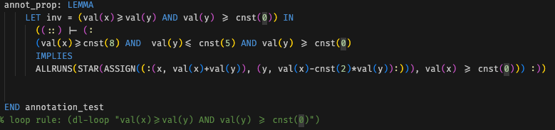
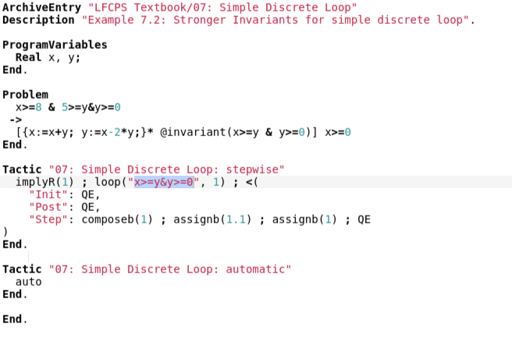

- You can do something similar to KeYmaera's [[Annotations]] in [[PVS]], but you have to define such invariants outside of the dL sequent, in the PVS antecedent. Furthermore, whenever you call the invariant, you must use (replace -1) so that dL can actually understand what you are doing rather than only displaying the name of the invariant.
  ex:      
  However, it seems this could be automated and made a lot better  
- keymaera example: #KeYmaera
	- {:height 374, :width 647}
