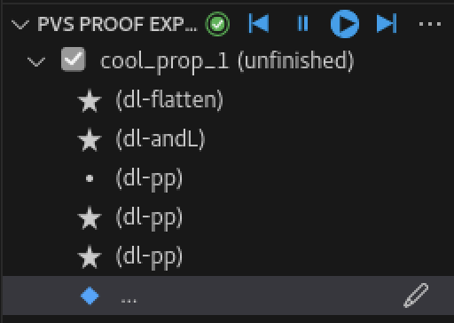

Discrepancies
=============
- ## KeYmaera/PVS Discrepancies
	- ~~annotations of invariants/ghosts (in the form @invariant "expression")~~
		- see ../pages/Annotations.md
	- `auto` command
	- KeYmaera has command suggestions, list of possible commands/their functions
  - "~~[Tactic](../pages/Tactic.md)" section inside proof files that outlines how the proof is solved (i think there is a similar thing in PVS but it is not formatted as well)~~
		- see <M-x> step-proof, generate prooflite, etc
  - when [diffghost](../pages/diffghost.md) reaches an error there is no error message
		- test this
	- reaching an error duplicates the last proof command on the proof explorer
    - 
  - Note: dl-solve cannot be used if a variable called 't' is in the pre-existing proof
	- dIClose:
		- "Differential Invariant Auto-Close"
		- automatically closes all branches produced by a `dIRule` (regular invariant where you must manually close the branches
    - see [dIClose](dIClose.md)
