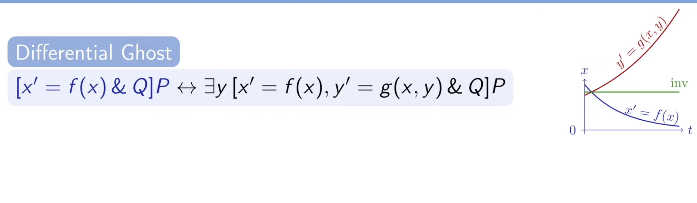

Wiki
====

# Resources
  - intro video + what dL/HPs are used for: [here](https://www.youtube.com/watch?v=qtQIUJQRvug)
	- (free)André Platzer  Lectures for each chapter of his book, pdf below:
		- (https://www.youtube.com/watch?v=EZ20CLwG6m8&list=PLnQeVMgmt_JcconLGqs20_I_Z0-nRMOLU&index=1)
		- good for understanding certain dL concepts
		- note: they are implemented in Plaidypvs with the same logic, but in a different looking format, not just logic statements
- 
		- ^^ Andre's book (he kinda coined the term Differential Dynamic Logic)
  - 
		- ^^Table of logical operators often used in dL writing (such as Andre's book)
  - 
		- Tanner's paper about dL, doesn't fully explain some basic topics, make sure you have some understanding before reading
		- very good place to learn about Plaidypvs in general
  - 
			- ^^Logical definitions of some proof rules in Plaidypvs
				- proof commands like assert, grind, prop, all just automate repeated proof rules like the ones above
				- these are the foundations of the commands you normally use
			- uses logical notation and abbreviates some commands
				- ex. Differential invariant (diffinv), differential cut, etc
  - [Glossary_Plaidypvs.pvs](https://github.com/n-crespo/NASA-2023/blob/master/assets/Glossary_Plaidypvs_1687804520945_0.pvs)
		- List of various Plaidypvs commands and some examples of Lemmas that can be proved with each command
		- pretty good reference, doesn't really explain how some commands work
		- Note: step through proofs to better understand proof commands
		- Found in Examples folder inside `nasalib/dL` (can be found on github)
		- In same folder: other examples of rotation, turns, etc
  - [cade-prop-pred-pvs.pptx](https://github.com/n-crespo/NASA-2023/blob/master/assets/cade-prop-pred-pvs_1687804893459_0.pptx)
		- good intro to PVS commands (not Plaidypvs)
		- Full folder includes example questions to prove and their solutions (`prop_basic`, pred_basic + their solutions)
	- cool paper
		- [dTL2 : Differential Temporal Dynamic Logic with Nested Temporalities for Hybrid Systems](https://lfcps.org/pub/dTL2.pdf)
			- Jean-Baptiste Jeannin and André Platzer
- # Intro
	- theres not a lot of documentation on dL compared to PVS
	- André Platzer basically made the whole concept and made a paywalled book about it
		- I have pdf version
		- he also has recorded lectures on each chapter of his textbook for free on youtube
		- "Logical Foundations of Cyber Physical Systems"
	- dL is an embedding inside PVS
		- it has its own mini turnstile and own Commands (`dl-command`)
		- it is not the same as PVS
		- think of it as a small piece
	- pretty simple things I've modeled and/or proved:
		- newton's law of cooling 
		- example of a Bernoulli equation
		- population growth differential equation
		- bang bang controller 
		- two cars following each other 
	- "step through" an already solved proof (in vscode-pvs) by clicking prove, then clicking the arrows in the small window in the bottom left
	- if image becomes unresponsive 
		- click settings icon in the top left, ensure that cmd is mapped to the "meta" key, hit cmd, and click the window you want to focus
		- alternatively, click the second icon from the left on the top of the image, which opens an app switcher
		- note: if you don't want the meta key to be mistakenly activated whenever you cmd+tab away from the window, you can map it back to ctrl with the settings icon
		- if a popup (for example asking you to confirm quitting a proof) is unresponsive, hit tab multiple times until the buttons are selected, then hit enter to select one of them
	- if emacs pvs inside the image is not recognizing any libraries, you need to update the path
	- use the command `source setpvs.sh` 
		- the file should contain:
		  ```shell
		  export PVS_DIR=$HOME/pvs/pvs-7.1.0
		  export PVS_LIBRARY_PATH=$PVS_DIR/nasalib
		  ```
	-
	  ```bash
	  rm .pvscontext
	  cd pvsbin/
	  rm *.bin
	  
	  
	  proveit -C
	  
	  
	  ./cleanbin-all 
	  (inside nasalib)
	  ```
- # Notes
	- ## First do this
		- go through the useful resources page
		- watch the intro video
		- read some documentation and papers about PVS and dL (See 
		- ask Tanner for his paper about dL, its super useful
	- ## Intro to PVS
		- turnstile: `|---------------------`
		- Propositional Logic: if, and, or, etc
		- LEMMA: thing you need to prove
		- above the turnstile : ALL IS TRUE (AND) (antecedent)
		- below the turnstile : one is true ALWAYS (OR) (consequent)
	- ## Writing things in PVS and dL
		- ### Creating and Referencing Variables
			- Constants can be defined as PVS variables like so, and must be referenced with a `cnst( )` around them  
				- `x: VAR real`
			- Variables are defined as natural numbers with UNIQUE arbitrary values that correspond to their index, and must be referenced with a `val( )` around them  
				- `x: nat = 0`
    - [`IMPORTING dL@top`](https://github.com/n-crespo/NASA-2023/blob/master/pages/IMPORTING.md)
		- `DIFF()`: 
		- `LEMMA` 
		- `UNION()` 
		- `IFTE()` 
		- `(BETA)` 
		- `TEST()`: 
		- `div_safe_re()` 
		- `SEQ(HP, HP)` 
		- `STAR(arg)` 
		- `^^`: 
		- `ALLRUNS(DIFF(), postcondition)` 
		- `SOMERUNS(DIFF(), postcondition)` 
	- ## Proving things in PVS and dL
		- ### Miscellaneous
			- `(inst)`: 
			- `(skolem)`: 
			- `(skeep)`: 
			- `(flatten)`: 
			- `(split)`: 
			- `(expand)`: 
			- `(iff)`: 
			- `(replaces)`: 
			- `(skoletin)`: 
		- ### Simplification
			- `(prop)`: 
			- `(bddsimp)`: 
			- `(assert)`: 
			- `(ground)`: 
			- `(smash)`: 
			- `(grind)`: 
			- `(metit)`: 
		- ### Utilities
			- `(help)`: 
			- `(lemma)`: 
			- `(quit)` 
			- `(undo)` 
			- `(hide)` 
			- `(postpone)` 
		- ### dL Commands
			- See `dynamic_logic.pvs` for definitions and `Glossary_Plaidypvs.pvs` for examples  
			- `(<command>b)` 
			- `(<command>d)` 
			- `(dl-loop)` 
			- `(dl-solve)` 
			- `(dl-subs)` 
			- `(dl-composeb)` 
			- `(dl-flatten)`: 
			- `(dl-ghost)`: 
			- `(dl-diffghost)`: 
			- `(dl-diffinv)`: 
			- `(dl-inst)`   
			- `(dl-grind)` 
			- `(dl-diffcase)`  
			- `DLEXISTSRf`: 
		
	- ## Differential Equations, Ghosts and Invariants
		- most differential equations are impossible to solve
		- solving ODE's will often make them more complicated then necessary
			- discrete ghost `(dl-ghost)` 
				- extra variable introduced to a proof to analyze the model
				- remember the value of a new variable in an old state for analyzing the change of an expression
				- discrete variable y which remembers the value of e (fresh)
				- Fresh Variables = new variable that doesn't affect main function
		- differential ghosts:
			- evolve over time
			- extra variable added with a made up differential equation to analyze the system
			- increase complexity of the system
			- change the differential equation itself
			- (auxiliary variables) added to make the proof more conclusive, don't really exist
		- `diff-ghost`: 
			- you are trying to prove x is always positive (it approaches 0 as it reaches infinity)
			- you introduce a new equation: $y' = y/2$
			- then you can say that `x*y^2=1`
			- why? because $y^2$ is always positive, so anything that x is must also be positive
			- y acts as a counterweight, always lifting x just enough to remain positive
			- my questions:
				- how do you figure out what y should equal?
					- GO BACKWARDS
					- we know that you have to use `diffinv` right after you introduce the ghost, so do that and have an unkown j(x) as the ghost
					- you should end up with an equation that = 0, so find the ghost expression that can satisfy it
					- THATS IT
				- how can you know for sure that `xy^2=1` ?
					- that is just a property of any positive number $$(x)$$ , use some reasoning to find small expressions like that that work for all numbers so you can build ghost variables around them
				- the new function must exist for as long as or longer than the original function that you are reasoning about
		- `(dl-diffinv)`: diffinv
			- use it after `diffghost`
			- when you have a Hybrid Program and something you want to prove is true (the HP would define the movement of the variable in the equation), differentiate the equation (and make sure to use values like x', y', etc) and plug in the values that you know those primes are equal to (from the HP definition)
			- you should get stuff that cancels out !!
			- (or rather an equation that equals 0)
		- useful graphic:
			- Below: the differential ghost equation acts as a counterweight to f(x), ensuring that $$xy^2 = 1$$ will always be true, proving that x must always be positive
			- 
				-
	- ## Off-Topic Math
		- Random slightly off-topic math:
			- you can define real numbers as the set of all lowest upper bounds of all nonempty, ___ sets
				- for example, take the set:
					- $x^2 <= 2$  and assume x is a rational number
					- the $lub$ , or lowest upper bound, is $sqrt(2)$
			- also, like everything in math can be described using limits,
				- ex. the double ^^ is just the x^^a = limit of x^^q as q approaches A
			- also rational numbers (or reals i think? forgot) are like 0% of all numbers
				- if you took a random number theres a 0% chance it would be rational (or real) (i forgot)
				- they also have lots of holes in them, namely irrational numbers like $sqrt(2)$ and $pi$
- # KeYmaera
	- see KeYmaera
