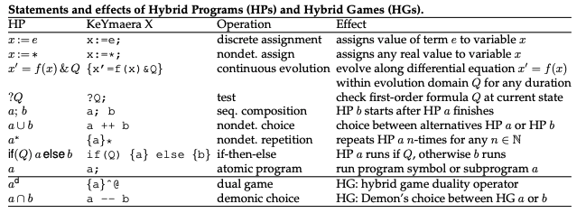
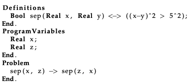
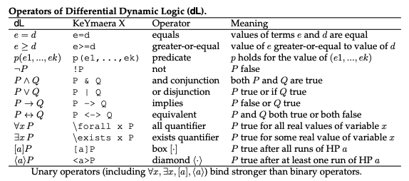

# KeYmaera

- browser-based JS frontend
- prove by clicking 🤮
  - ~~need to learn [loop invariant](../pages/loopinvariant.md) because that is
  kinda common with Andre's proofs~~
  - I learned how to use iterateD, which is very useful for dealing with loops

## How to write stuff with KeYmaera

```KeYmaera
ArchiveEntry "<name of file>"
  Description "<description>".
    Title "<title>".

Definitions // constant variables
  Real x;
    Real y;
End. 

ProgramVariables // changing variables
  Real a;
    Real b;
End.

Problem // in the form: <antecedent arguments> -> [{dynamics 1}{dynamics2}postcondition+annotations]
  v>=0 & A>0 & B>0
->
[
  {
    {?v<=5;a:=A; ++ a :=0; ++ a:=-B; }
    {x'=v , v'=a & v>=0}
  }*@invariant(v>=0)
] v>=0
End.

Tactic "Tactic Description" // describe proof rules to solve lemma
  (here)
End.

End. 
```

## `existsRmon`

- I was getting $0 = 1$ because I never instantiated the term $g = 1/\sqrt t$
- solution:
  - right click the $E$ term so you can put in a $\theta$ that is that term
  - continue until you reach an obvious true statement (likely equals 1 and
  variables cancel out) and the engine fails to understand its truth...
- This problem was fixed with `existsrmon`, where an entire expression can be instantiated
  - see [existsRmon](existsRmon.md)

## Syntax

- must end every section with `End.`
- constant and variables are separate  >> ProgramVariables and Definitions
- note the use of square and squiggly brackets in the `Problem` section

  ```keymaera
  ArchiveEntry "cooling law"

  Definitions
    Real to;
    Real k;
  End.

  ProgramVariables
    Real temp;
  End.
  
  Problem
    ta = 0 & temp > to
    ->
    [{
      {temp'= -k*(temp-to)
    }]temp > to
  
  End.
  End.
  ```

- ODE tactic tries to automatically prove differential equation systems
`[{x'=f(x) & Q}]P` and is especially good at searching and proving invariants.
If you do not need invariant search but only want to prove the postcondition
invariant, use ODEinv instead. Complicated cases may benefit from other more
dedicated proof rules to obtain faster proofs.
- See also
  - `ODEinv` ODE invariant proving without search
  - `dI` Differential invariant to prove the formula R is an invariant of the
  differential equation system.  
  - `dC` differential cuts: to first prove another property of the differential
  equation and then assume it during the dynamics.
  - `dW` differential weakening: to prove a property that directly follows from
  the evolution domain constraint.
  - `dG` differential ghosts: to add a fresh variable with a new differential
  equation into the dynamics.
  - `odeInvC` Complete ODE invariants: attempt an exhaustive (slow) proof that P
  is invariant for the ODE x'=f(x)&Q.

## More Syntax

- 

## Predicate Symbols

- 
- 

## Annotations

- To use a [star](star.md), which looks like this `*`, ensure that a set of
curly braces surround ALL the differential equations in the program, as well as
each individual differential equation. This might mean that one equation has two
sets of curly braces around it. [loop invariant](loopinvariant.md)
- To add an annotation, include the `@invariant` directly after the `*` in a
hybrid program. This is before the square brackets but after the totally
surrounding curly braces. [loop invariant](loopinvariant.md)

## Proving Things

- see Tactic Library:
  - <https://keymaerax.org/scaladoc/edu/cmu/cs/ls/keymaerax/btactics/TactixLibrary$.html>
  - <https://keymaerax.org/scaladoc/edu/cmu/cs/ls/keymaerax/btactics/HilbertCalculus.html>
  - <https://keymaerax.org/scaladoc/edu/cmu/cs/ls/keymaerax/btactics/SequentCalculus.html>
- see Tutorial Paper
  - <https://keymaerax.org/KeYmaeraX-tutorial.pdf>
- see Cheat Sheet
  - <https://keymaerax.org/KeYmaeraX-sheet.pdf>
